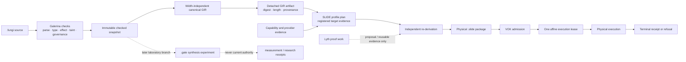

# Galerina to SLIDE and VOK current flow

Date: 2026-08-24

Status: source-verified planning map. Non-authorizing. No `.fungi` or `.gate`
source was created or changed for this map.

## Current route

## Verified ownership

| Owner | Owns | Does not own |
|---|---|---|
| Galerina | source semantics, checked snapshot, canonical GIR | physical profile selection or execution admission |
| SLIDE | registered profile plan, physical package, independent re-derivation | Galerina semantics or self-authorization |
| VOK | admission, one affine lease, terminal consumption receipt | profile proposal or reusable proof work |
| Lyth | reusable proof work for one closed context | `ALLOW`, a VOK lease, or admission |
| `.gate` laboratory lane | later synthesis measurements | replacement of canonical GIR/SLIDE/VOK |

## Physical profile state

- [x] Trit remains one widthless semantic value in `{-1, 0, +1}`.
- [x] Scalar width `1` is the current active reference profile.
- [!] Widths `32`, `64` and `256` are registered but inactive in the current
  SLIDE source.
- [ ] Implementation order remains `1`, then `64`, then `256`.
- [ ] Width `32` remains an explicit compatibility replan only.
- [X] Runtime rescue or silent profile substitution is forbidden.
- [x] An admission-time replan creates a new identity and receipt before
  execution.

## Graph and index shape

Keep one exact-head structural graph as the cross-language source of
relationships. Generate typed views from it; do not create competing authority
graphs.

| View | Content | Claim boundary |
|---|---|---|
| Host implementation | `.ts`, `.mjs`, related manifests and tests | bootstrap/differential implementation |
| Fungi semantics | `.fungi`, compiler stages, checked snapshot and GIR edges | language and semantic ownership |
| Gate laboratory | `.gate` and synthesis-only edges | experimental, non-authorizing |

The three views should share one manifest containing the repository build
point, unified-graph digest, view rule digest and each view digest. Myco remains
the lexical discovery overlay. Hypha remains a passive scanner. Neither stores
source bodies in the structural graph or upgrades a miss into absence.

Do not combine `.fungi` and `.gate` into one authority view: `.gate` is a later
laboratory lane and cannot inherit Galerina or VOK authority.

## Myco preparation map for future `.fungi` work

Myco positive discovery confirms the existing route is already documented
around checked snapshots, canonical GIR and the detached SLIDE handoff. The
future conversion procedure is therefore:

1. Resolve the exact TODO task and governing RD decision.
2. Bind the current committed repository head and clean custody state.
3. Use the structural graph for symbols, call paths and cross-owner boundaries.
4. Use Myco for bounded lexical/source-shape discovery and Hypha for passive
   capability observations.
5. Draw the proposed semantic flow and hostile controls before authoring.
6. Prove scalar differential behavior and refusal behavior first.
7. Emit detached canonical GIR from a verified checked snapshot.
8. Require SLIDE re-derivation, a registered profile and VOK terminal receipt.
9. Retain TypeScript/MJS until exact consumer and retirement gates pass.

Current stop: Galerina RD-0858 Unit 4 Task 6 Step 1 has no already admitted
fixed checked scalar-flow artifact. Creating or admitting that flow is the next
productive action and crosses the active `.fungi` boundary. This map does not
reopen it.

## Phased verification shape

Run one phase at a time. Preserve every refusal.

1. **Custody:** exact branch, head, staged and unstaged inventory.
2. **Focused controls:** only tests that exercise the changed requirement axis.
3. **Generated owners:** graph, registries, indexes and documents in declared
   dependency order.
4. **Governed assurance:** the manifest runner executes entries sequentially
   under one suite lease, with per-entry deadlines and output caps.
5. **Independent checks:** exact committed bytes, hostile controls and claim
   hygiene.
6. **Final indexes:** Myco, structural graph and typed view receipts at the
   final committed head.

Do not launch package, audit, graph and index estates concurrently. A skipped,
timed-out or unexamined phase is `UNKNOWN` or `REFUSED`, never a pass.
