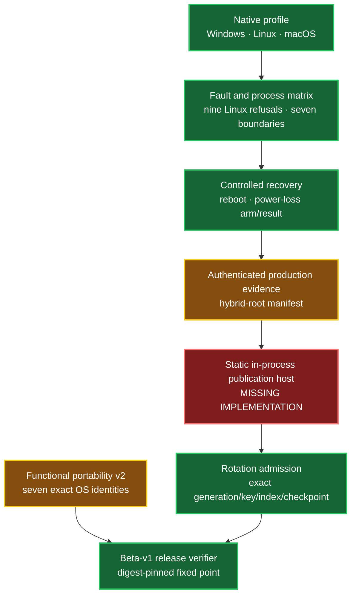

# Beta-v1 platform durability implementation report

Date: 2026-08-01

Branch: `codex/galerina-beta-v1-completion`

Authority: repository implementation evidence; non-authorizing

## Outcome

The Linux, Windows and macOS native candidate implementations, injected fault
surfaces, common seven-boundary process-termination harness, safe controlled-
recovery protocol, production-profile composition and seven-OS beta release
verifier are implemented and locally committed. Windows 10 ordinary Galerina
functionality and its admitted native NTFS candidate pass on the current host.

External machines have not returned the complete current-commit matrix. One
production implementation blocker remains: standard Node cannot provide the
required statically linked in-process native publication seam, and Galerina
correctly refuses to promote a caller callback or pathname-loaded addon. No
red state has been hidden by changing a label.

## Architecture and evidence flow

Green means the repository implementation and current-host checks are present;
it does not mean absent external evidence has run. Amber means an external
receipt is pending. Red is reserved for the one missing trusted-path
implementation.

## Completed implementation

| Area | State | Fresh evidence |
|---|---:|---|
| Closed durability evidence classes | complete | 6/6 focused before later package growth; copied and over-claimed records refuse |
| GNU Linux adapter | complete | pure 10/10; nine injected fault identities; live/fault/process suites compiled and await current Ubuntu execution |
| Ubuntu closed verifier | complete | 21 focused tests; stable direct four-file intake; current external receipt absent |
| Windows profile | complete | Windows 10/11 identity gate; current Windows 10 native/profile 7/7; seven-boundary termination pass |
| macOS profile | complete | pure/fault vocabulary 4/4; off-host refusal 2/2; Apple Arm64 cross-target Clippy/check pass; live APFS pending |
| Controlled recovery protocol | complete | 6/6; canonical arm/result, exact old-or-new, replay/mixed-state refusal, native prohibited-device check |
| Production profile composition | complete | hybrid Ed25519 + ML-DSA-65 verification, revocation/window/identity binding; app-kernel 203/203 |
| Rotation pre-transition gate | complete | missing/copied/mismatched profile refuses before forward probe |
| Functional receipt v2 | complete | clean Windows 10 build 19045 run: 6/6, 98 packages, Wasm result 42 |
| Beta release verifier | complete | 13/13 platform/release tests; missing policy denies while missing external receipt remains K3 `0` |

Implementation commits include:

- `6ac87ee3` — closed durability evidence vocabulary;
- `9cda14e5` — Linux refusal controls;
- `1394f37e` — Ubuntu evidence verifier;
- `44ea2c23` — production profile and rotation binding;
- `6fd1921c` — seven-OS beta release admission;
- `9bce1538` — missing-policy denial correction;
- `a65e7410` — macOS and complete Windows profiles; and
- `26f5755c` — controlled recovery protocol.

## Current verification

On Windows 10 x64, build 19045:

- `cargo fmt --all --check` — pass;
- all-target/all-feature Clippy with warnings denied — pass;
- native default tests — pass;
- native all-feature tests — pass;
- native optimized default build — pass;
- Windows native/profile — 7/7;
- Windows process termination — all seven boundaries pass;
- recovery protocol — 6/6;
- app-kernel — 203/203;
- platform/release focused scripts — 13/13; and
- clean functional smoke — 6/6, 98 packages, K3 `0`.

## External evidence still required

| Evidence | State | Required next action |
|---|---:|---|
| Ubuntu live/fault/process round two | pending | Run the current handover; the returned `2ceaf479...` report predates this adapter |
| Windows 11 functional/native | pending | Run exact Windows 11 self-hosted profile |
| Debian functional | pending | Return bounded functional v2 receipt |
| Fedora functional | pending | Return bounded functional v2 receipt |
| Linux Mint functional/native | pending | Run exact self-hosted Mint profile |
| macOS functional/native/process | pending | Run Apple Arm64 on direct internal APFS |
| Controlled reboot | pending | Use separate sacrificial host/volume only |
| Controlled physical power loss | pending | Owner-operated external power action on sacrificial hardware only |
| Repository fixed-point receipt | pending | Rerun every graph/audit/test/generator after external evidence returns |

No current evidence permits a power-loss, Windows 11, macOS or current Linux
claim by inference.

## Production rotation blocker

`persistRegistryGeneration` runs in Node and can accept only a branded host-
evidence callback. The production receipt set is deliberately unreachable from
that callback. A conventional native addon is pathname-loaded; source/binary
hashing after load cannot prove the executed initialization bytes were the
verified bytes. A spawned CLI would be a sidecar and would split the authority
operation. Both approaches violate the approved trusted-path contract.

The acceptable closures are:

1. a signed custom host with the native adapter statically linked and owning
   the entire publication operation; or
2. the later content-bound SLIDE host once its native executable backend exists.

Until one exists, rotation remains fail-closed before the forward probe and
the production durability digest list remains empty. Ordinary Galerina
functional execution is not disabled by an unsupported production-rotation
profile.

## Next exact sequence

1. Return current Ubuntu round-two evidence and run its closed verifier.
2. Decide and implement the static activation host rather than weakening the
   loader boundary.
3. Run Windows 11 and macOS native handovers.
4. Run reboot and power-loss rows only on sacrificial systems.
5. Collect all seven functional v2 receipts.
6. Regenerate every graph, audit, test, generator and release-build receipt.
7. Run final beta-v1 release admission; promote only an exact `+1`.
