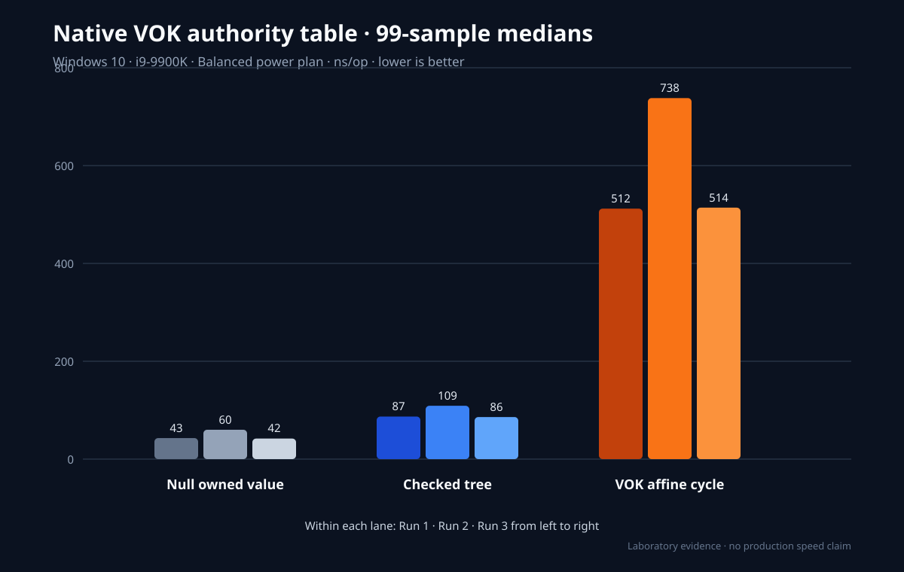

# Native VOK authority table evidence report

**Date:** 2026-08-02

**Status:** bounded authority-to-W^X floor linked; non-authorizing

**R&D:** `ZTF-Knowledge-Bases/RD-0660-native-vok-authority-table.md` and
`ZTF-Knowledge-Bases/RD-0662-native-vok-wx-execution-floor.md`

## Outcome

The first bounded VOK authority-to-execution floor now exists inside
`@galerina/core-runtime/native/vok-authority`. Its small audited OS adapter is
private within the same crate: `unsafe` is denied everywhere except the exact
platform module. This consolidation fixes the initially detected safe-executor
bypass; another local crate cannot call execution without an affine VOK lease.
The adapter supplies OS entropy and executes only one exact semantic object
profile through an anonymous RW-to-RX mapping. It exposes no FFI handle,
pathname or caller-controlled machine-code surface and cannot set
`authority_released` true.

Implemented controls:

- opaque non-`Clone`, non-`Copy`, non-`Send`, non-`Sync` admitted and lease
  types with private fields and redacted debug output;
- exact table, slot, generation, nonce, tag, target, policy, verifier and epoch
  checks on every transition;
- fixed table/object bounds, a deterministic free list and a hard-bounded exact
  nonce-history set;
- injected nonce source with zero, repeat, unavailable and budget-exhaustion
  refusal;
- consume-by-value admitted-to-lease and lease-to-value-only-receipt changes;
- monotonic context advance, eager revocation, logical owned-byte clearing and
  generation-overflow retirement; and
- exact 16-byte closed-object parsing, fixed internal x86-64/AArch64 emitters,
  direct Windows/Linux/macOS OS entropy, no RWX request, instruction-cache
  flushing, protection checking and terminal unmapping; and
- no integer handle decoder, Boolean shortcut, serialization dependency,
  raw-code/path fallback or ordinary receipt-to-authority conversion.

## Verification

| Gate | Fresh result |
|---|---:|
| consolidated native unit/hostile tests | 30/30 |
| public compile-fail doctests | 14/14 |
| native eight-gate mint vectors | 6,561/6,561; one mints |
| native nine-gate vectors | 19,683/19,683; one authorizes |
| native versus `.fungi` byte parity | 19,683/19,683 exact |
| `cargo fmt --check` | pass |
| `cargo clippy --all-targets --locked --offline -- -D warnings` | pass |
| `cargo deny check` | advisories, bans, licenses and sources pass |
| `cargo audit` | 1 local crate; no vulnerable dependency |
| Grype directory scan, high fixed threshold | no vulnerabilities found |
| Windows x86-64 live W^X receipt | result 42; executable true; writable false; authority false |
| source target checks | Windows x64, Linux x64/Arm64, macOS x64/Arm64 pass |

An app-backed Codex Security scan is counted only if its separate workbench
start and finalization complete. A waiting or unacknowledged workspace is not
passed evidence.

## Bounded W^X profile

The admitted object is exactly 16 bytes: magic `GVEO`, version `1`, profile
`return-u64`, current architecture, zero flags and one little-endian value.
Caller bytes cannot describe instructions, imports, relocations, constructors,
writable globals, paths or entry offsets. The internal emitter creates one
fixed return stub.

The current Windows evidence command is:

```text
cargo run --manifest-path native/vok-authority/Cargo.toml --locked --quiet --bin vok-live-evidence
```

It returned:

```json
{"schema":"galerina.vok.native-wx-live.v1","verdict":"PASS","target":"x86_64","k3Vectors":19683,"result":42,"executableAtCall":true,"writableAtCall":false,"authorityReleased":false}
```

The Windows adapter allocates writable/non-executable memory, copies the fixed
image, changes it to `PAGE_EXECUTE_READ`, flushes the current process's
instruction cache and requires `VirtualQuery` to report committed exact
`PAGE_EXECUTE_READ` immediately before the call. No writable-and-executable
constant or request exists. Linux performs the equivalent RW-to-RX transition
and inspects `/proc/self/maps`; macOS performs the exact transition and cache
invalidation but still requires an independent live hardened-runtime receipt.

## Benchmark method

`vok-benchmark` is a versioned, release-mode, dependency-free harness. Each run
contains 99 samples and 1,000 operations per sample. Lane order rotates between
samples. The three lanes are:

1. `null_owned_value`: allocate and consume the same three-byte owned value;
2. `checked_btree`: insert, exact-read and remove a keyed value from a standard
   checked tree; and
3. `vok_affine_cycle`: mint, exact open and exact consume through the complete
   VOK table, including two nonce admissions, context checks, logical clearing
   and a value-only receipt.

Host: Intel Core i9-9900K, Windows 10 Pro 10.0.19045, Balanced power plan,
`rustc 1.96.1`. Values are nanoseconds per operation.

| Run | Lane | min | p25 | median | p75 | max |
|---:|---|---:|---:|---:|---:|---:|
| 1 | null owned value | 41 | 41 | 43 | 44 | 62 |
| 1 | checked tree | 85 | 85 | 87 | 87 | 112 |
| 1 | VOK affine cycle | 493 | 500 | 512 | 517 | 785 |
| 2 | null owned value | 42 | 59 | 60 | 61 | 65 |
| 2 | checked tree | 84 | 109 | 109 | 111 | 115 |
| 2 | VOK affine cycle | 494 | 725 | 738 | 742 | 759 |
| 3 | null owned value | 41 | 41 | 42 | 62 | 66 |
| 3 | checked tree | 84 | 85 | 86 | 109 | 112 |
| 3 | VOK affine cycle | 494 | 510 | 514 | 739 | 773 |

Median ratios are:

```text
run 1: VOK / checked = 512 / 87  = 5.89x
run 2: VOK / checked = 738 / 109 = 6.77x
run 3: VOK / checked = 514 / 86  = 5.98x

run 1: VOK / null = 512 / 43 = 11.91x
run 2: VOK / null = 738 / 60 = 12.30x
run 3: VOK / null = 514 / 42 = 12.24x
```

The similar relative ratios and bimodal third-run quartiles indicate host clock/
power-state sensitivity. Absolute values are laboratory evidence only. They do
not establish production latency, cross-platform performance, W^X execution
speed or an advantage over an executable SLIDE backend.



## Still open after the bounded floor

- opaque Galerina VM/component-resource transfer;
- same-process hostile-memory isolation/integrity;
- physical erasure evidence rather than logical clearing;
- general VEO functions, parameters, GIR lowering, imports, relocations and
  independent object verification;
- independent cross-platform reproduction; and
- completion of the separately acknowledged app-backed security scan.

Those gates do not reopen the completed bounded floor. They prevent it from
being described as the general SLIDE backend or production execution authority.
