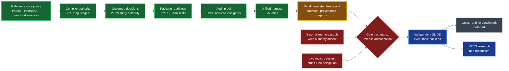

# Galerina beta-v1 zero-trust tooling close

**Evidence date:** 2026-07-30

**Branch:** `codex/galerina-beta-v1-completion`

**Repository action:** local commits only; nothing pushed

**Release verdict:** **NOT COMPLETE / NON-AUTHORIZING**

The tooling refactor and discoverable local verification are complete to the
current evidence boundary. Galerina beta-v1 is not released: the external
memory graph lacks owner write authority, and the live registry is not ready
for the offline signing act.

Package readiness reaching 100% does not mean the whole product is complete.
The live percentage audit separately reports:

| Meter | Result | Meaning |
|---|---:|---|
| Package/test ship readiness | **100%** | All 97 registered packages have governed, non-empty test evidence |
| Zero-trust thesis | **78%** | Asserted architecture-progress meter; not a release verdict |
| Build progress | **75%** | Asserted implementation-progress meter; not a release verdict |

Seventeen of nineteen percentage rows remain explicitly hand-typed assertions.
Only one row is live-measured and one is a measured ladder. The audit prevents
new unevidenced percentages and prevents evidenced rows from returning to
assertion-only status.

## Architecture and current state

Green means freshly verified. Amber means repository-local finalization remains
in progress. Red means a release-authorizing prerequisite is absent. Blue is
future SLIDE work and cannot lend evidence to Galerina.

## What has been completed

### Language and governed authority

- All seven canonical compiler-stage `.fungi` specifications are authoritative.
- All twenty-nine governed decision twins are authoritative `.fungi`
  specifications.
- The TypeScript implementations remain differential/bootstrap shadows. No
  `.ts` file is removed before executable SLIDE integration supplies the
  replacement runtime and host boundary.
- The implicit `.fungi` known-failure baseline is zero.
- The admitted curriculum is 232/232 with zero known diagnostic drift.
- `.fungi` source quality is clean across 103 governed non-fixture files.
- K3 authority remains explicit; no Boolean coercion or arithmetic XOR grants
  authority.

### Packages, tests and developer tools

- Workspace/package reconciliation covers all 97 direct children governed by
  the package inventory.
- The root build-current aggregate passes **97/97 packages and 8,587 tests**.
- The unified `galerina-test all --json` run passes:

  | Lane | Fresh result |
  |---|---:|
  | Unit | 8,587 |
  | End-to-end build | 4/4 |
  | Conformance | 10/10 |
  | Fidelity | 9/9 |
  | Galerina SLIDE-adapter corpus | 496/496 |

- The independent scripts suite passes **208/208**.
- The compiler package passes **5,748/5,748**.
- App-kernel passes **127/127**.
- Tower Citizen passes **476/476**.
- Myco passes **52/52**.
- Tri-Pipe passes **24/24**.
- Tri-Regex passes **34/34**.
- TritSocket passes **11/11**.

### Audits and anti-neutering

- All 80 discovered audit/lint gates have executable refusal and control
  evidence.
- Every one of the 34 audit/lint tools outside phase-close was executed
  directly without `--soft`.
- The security mutation catalog killed **59/59** mutants.
- The WAT emitter mutation audit killed **3/3** independent arithmetic
  mutants.
- Mutation targets were restored exactly; no `.bak` residue remains.
- Graph integrity is structurally clean at **7,896 nodes, 8,174 edges**, with
  no dangling edge, duplicate identity, or dependency cycle.
- Package Hardened Borders pass **97/97**.
- Diagnostic conformance reports 345 code/name pairs and zero violations.
- Diagnostic documentation agrees for all 203 codes present in both source and
  the canonical Knowledge Base.
- Generator contracts pass **14/14** with isolated output, deterministic
  fixed-point checks and provenance validation.
- SBOM evidence covers 169 components plus the root, 98 dependency records and
  zero hygiene warnings.
- Exact install-script policy is fail-closed: strict mode is enabled and only
  `argon2@0.44.0` is approved. Registry-signature audit verified 48 package
  signatures and 14 attestations, including Argon2 provenance.

### Platforms

- Windows 10.0.19045 x64 is locally verified.
- Windows Server 2022, macOS 14, Ubuntu 24.04, Debian 12.15 and Fedora 43 jobs
  are configured but unverified until their runners execute.
- Exact Windows 11 and Mint 22 verification remains self-hosted and
  unverified; no proxy platform is relabelled as evidence.

## What the design cuts

- Workspace-only discovery that omitted real package directories.
- Stale `dist/` reuse being counted as a fresh build.
- Empty, malformed, timed-out, signalled or uncountable test output being
  counted as success.
- Parent phase gates returning zero after a failed blocking child.
- Audit/lint tools without executable anti-neutering proof.
- Timestamp-only generated-artifact freshness.
- Generators writing into the repository while judging their own output.
- Unexplained compiler graph orphans.
- Ambient package dependency forests as the future Galerina package model.
- Implicit fallback, unknown-to-allow collapse and neural authority.
- Treating Galerina's SLIDE-adapter tests as evidence for independent SLIDE.
- Publishing Wasm/Rust/Python/SLIDE performance claims before SLIDE executes.
- Using “shape shadow” as a formal architecture or artifact name.

## What remains in Galerina

The enforced gates are green, but report-only audits intentionally expose
unfinished work:

| Work inventory | Current evidence | Required disposition |
|---|---:|---|
| Module-wide WAT nodes the emitter refuses | 132, including 74 on a live run path | Lower or retain as an explicit fail-closed beta limitation |
| Stale negative teaching examples | 42 | Repair compiler support or re-adjudicate the lesson without weakening its contract |
| Signing-path refusal codes with no direct test mention | 19 | Drive one refusal plus its own control per code |
| Cross-package relative imports | 34 | Replace with declared canonical peer-package imports |
| Pre-SLIDE package-local `node_modules` trees | 95 | Remove only after executable SLIDE package resolution exists |
| Deferred nested native package | 1 | Flatten after executable SLIDE integration |
| `.fungi`/`.ts` source-file mix | 101 / 449 across 95 code packages | Do not confuse with governed-authority completion; literal `.ts` retirement is post-SLIDE |
| Diagnostic full-audit warnings | 78 | Work through exported identities, direct tests, severity adjudication and dead definitions without inventing authority |
| Real code tokens outside numeric-tail catalog | 80, including 51 on signing path | Extend the catalog/index shape before claiming complete coverage |

These are not silently converted into release-pass claims. The beta-v1
acceptance definition uses `.fungi` authority at the governed decision
boundary; literal TypeScript retirement was explicitly deferred until
executable SLIDE integration.

## Two blocking release conditions

### 1. External memory graph — owner authority required

The graph family is **5/6**:

- project graph: pass;
- graph integrity: pass;
- Knowledge Base graph: pass;
- package graph: pass;
- dev-tool graph: pass;
- memory graph: refused.

Four external directories contain a `MEMORY.md`. RD-0582 strongly identifies
candidate ID `958d1a5f`, but explicitly says identity is not write authority.
No tool may create or refresh that directory's `MEMORY-GRAPH.json` until the
owner gives that narrow permission. The private absolute path does not need to
be printed or committed.

### 2. Offline registry signing — not ready

The hybrid v2 mechanism is green:

- Ed25519 plus ML-DSA-65, both required;
- domain-separated signed bytes;
- v1 verify-only;
- strict replay floor;
- downgrade, tamper, revocation and malformed-input refusal;
- disposable-key ceremony proof.

The live signing act is **NOT READY** because:

- both live registry entries are content-less, unreviewed stubs;
- reviewable package bytes are absent;
- no separate operational registry authority is declared;
- no root-authorized operational-key delegation format and verifier exists.

The owner should not use the cold root to clear this status. Follow
`docs/security/OFFLINE-KEY-SIGNING-WALKTHROUGH.md` only after every preflight
row is green and the project explicitly reports `READY FOR OWNER SIGNING`.

## Formal SLIDE R&D terminology

The engineering term for the reusable fixed structure is **Verified
Parametric Execution Graph (`VPEG`)**:

- **Semantic VPEG:** frontend-neutral GIR, typed parameters, effects,
  capabilities, guards and proof obligations.
- **Target VPEG:** one admitted lowering bound to a complete target, ABI,
  driver, policy and artifact identity.
- **Neural Shape Engine:** bounded, non-authorizing candidate discovery and
  synthesis.
- **Deterministic Shape Fabric:** authoritative re-derivation, verification,
  admission and refusal.

“Shape shadow” is descriptive talk only. It must not become a schema name,
interface, artifact, subsystem, or diagram label. Neural output never grants
authority, collapses K3, patches executable bytes, or bypasses independent
verification.

## Benchmark decision

The benchmark package, integrity tests, noise gate and chart renderer are
available and tested. No fresh cross-runtime chart is published in this close.
The owner explicitly directed that Wasm/Rust/Python/Galerina/SLIDE comparison
wait until SLIDE has an executable backend and identical workloads can be
measured. Historical files remain evidence only.

## Terminal fixed-point status

After the roadmap repair and complete fourteen-generator fixed point:

- strict phase-close is **83/84**;
- exhaustive phase-close is **84/85**;
- exhaustive's additional package child passed **97/97** package commands in
  **319.9 seconds**;
- every repository-local child is green;
- both cadences return non-zero solely because `graph:all` propagates the
  unauthorized external memory-graph refusal.

This is the intended fail-closed result. The project must not suppress the
memory child or relabel the non-zero cadence as an authorizing release.

No changes in this work were pushed.
