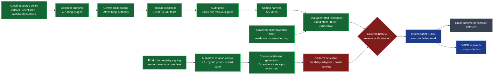

# Galerina beta-v1 zero-trust tooling close

**Evidence date:** 2026-07-31

**Branch:** `codex/galerina-beta-v1-completion`

**Repository action:** local commits only; nothing pushed

## Independent prepared-executor benchmark addendum - 2026-07-31

Independent SLIDE now has a bounded immutable V2-D prepared executor and a
fail-closed clean/prepared benchmark. Exact evidence is recorded in
`docs/reports/slide-prepared-executor-benchmark-2026-07-31.md`: 9 measured
samples per lane, identical semantic checksums, 8,090.17 clean ops/s,
170,103.91 prepared ops/s and 21.03x prepared/clean median throughput on the
named Windows 10 host. This changes no Galerina production authority and does
not satisfy the terminal cross-runtime benchmark gate.

**Release verdict:** **NOT COMPLETE / NON-AUTHORIZING**

The tooling refactor and discoverable local verification are complete to the
current evidence boundary. Galerina beta-v1 is not released because
platform-specific production activation of a complete automatically rotated
registry generation remains open. The automatic rotation safety/control core,
production registry signing, content-addressed generation core and
checkpoint-bound production loader are green; admitted platform durability
and crash/fault evidence are not. The
former external-memory
write question is closed by rejecting that architecture: private memory is
not a build input, and its beta inspection tool is ephemeral, read-only,
bounded, injection-aware, and non-authorizing.

The repository-local deterministic crash model is now complete. Its
seed-ordered matrix covers fifteen activation boundaries, binds the complete
schedule and evidence identity into canonical replay receipts, includes a
known-good control and planted faults, and refuses exhausted or malformed
exploration. The pure `.fungi` terminal fold is checker-clean; app-kernel is
**180/180**. This closes the model prerequisite only. It does not admit a
native adapter or prove physical durability on Windows, Linux or macOS.

The native pre-admission shape is also closed: platform, architecture, target,
filesystem, fixed loader location and source/contract/binary/toolchain/build
identities must match exact plain records; hostile storage facts refuse.
Complete evidence reaches `CANDIDATE` only. The immutable production digest
list is still empty, and app-kernel passes **186/186**. Binary loader proof and
real platform adapters remain release-blocking.

The first native implementation slice is narrower than an adapter: a
zero-dependency Rust Windows host probe passes **4/4** focused tests and
classifies the current temporary directory as fixed local NTFS. It refuses
relative/unavailable paths, reparse targets and ancestors, non-fixed drives,
remote-storage capability and non-NTFS/ReFS filesystems. This result cannot
mint a production receipt and includes no write, publication, barrier, reboot
or power-loss evidence. The empty production allow-list is unchanged.

The next provenance slice is also non-authorizing. A fixed-path native artifact
inspector passes **7/7**, including a red/green junction-ancestor regression.
It materializes one bounded single-link file, compares stable open-handle
metadata, verifies PE/ELF/Mach-O architecture markers and re-derives the exact
binary digest without executing the candidate. App-kernel is **193/193** and
the paired `.fungi` fold is **0 errors / 0 warnings**. Actual N-API
export/ABI proof and content-bound loading remain open; the inspector cannot
create a production receipt.

Primary-source loader research then found a genuine architecture boundary:
Node's public addon loader is filename-based, and Windows `LoadLibraryExW`
requires its file-handle argument to be `NULL`. Native initialization may run
before a post-load hash/file-ID check, so pre-hash + path load + post-hash is
rejected for production authority (**4.6/10** under the zero-trust score).
The production list remains empty. Platform syscall and recovery evidence can
continue independently, but final beta authorization needs owner adjudication
between a linked runtime, a narrowed OS/code-signing trust claim, or changing
the Galerina-before-SLIDE release order.

Platform work continued without granting loader authority. The
zero-dependency Rust candidate now opens an admitted direct Windows directory
with `CreateFileW(GENERIC_WRITE, FILE_FLAG_BACKUP_SEMANTICS)`, requires
`FlushFileBuffers` to succeed and checks handle close. The live Windows 10
fixed-local NTFS test passed as the earlier **5/5** checkpoint. This proved API
acceptance on one host, not crash or power-loss durability.

The same candidate now also executes exclusive same-directory staging,
write/file flush, checked close, no-replace write-through publication, exact
no-sharing re-open with stable open-handle identity, single-link/reparse
refusal and the native directory barrier. A planted hard-link destination
first failed and now refuses. Native evidence is **7/7**. This remains
non-authorizing until hostile parent-namespace behavior and real
process-kill/reboot/power-loss matrices pass on the required platforms.

A non-default fault-injection build now pauses a disposable worker at seven
exact publication boundaries. A parent test terminates one fresh process per
boundary and verifies that prior authority remains byte-exact while the
candidate name is absent or contains only the complete exact generation. This
process-termination matrix passes **7/7 boundaries** on Windows 10 NTFS.
Default builds do not compile the worker or observer seam. Kernel crash,
reboot, controller-cache and physical power-loss evidence remain red.

Package readiness reaching 100% does not mean the whole product is complete.
The live percentage audit separately reports:

| Meter | Result | Meaning |
|---|---:|---|
| Package/test ship readiness | **100%** | All 98 registered packages have governed, non-empty test evidence |
| Zero-trust thesis | **78%** | Asserted architecture-progress meter; not a release verdict |
| Build progress | **75%** | Asserted implementation-progress meter; not a release verdict |

Seventeen of nineteen percentage rows remain explicitly hand-typed assertions.
Only one row is live-measured and one is a measured ladder. The audit prevents
new unevidenced percentages and prevents evidenced rows from returning to
assertion-only status.

## Architecture and current state

Green means freshly verified. Red means a release-authorizing prerequisite is
absent. Blue is future SLIDE work and cannot lend evidence to Galerina.

## What has been completed

### Language and governed authority

- All seven canonical compiler-stage `.fungi` specifications are authoritative.
- All twenty-nine governed decision twins are authoritative `.fungi`
  specifications.
- The TypeScript implementations remain differential/bootstrap shadows. No
  `.ts` file is removed before executable SLIDE integration supplies the
  replacement runtime and host boundary.
- The implicit `.fungi` known-failure baseline is zero.
- The admitted curriculum is 232/232 with zero known diagnostic drift.
- `.fungi` source quality is clean across 103 governed non-fixture files.
- K3 authority remains explicit; no Boolean coercion or arithmetic XOR grants
  authority.

### Packages, tests and developer tools

- Workspace/package reconciliation covers all 98 direct children governed by
  the package inventory.
- The root build-current aggregate passes **98/98 packages and 8,735 tests**.
- The unified `galerina-test all --json` run passes:

  | Lane | Fresh result |
  |---|---:|
  | Unit | 8,735 |
  | End-to-end build | 4/4 |
  | Conformance | 10/10 |
  | Fidelity | 9/9 |
  | Galerina SLIDE-adapter corpus | 496/496 |

- The strict phase-close tooling child passes **265/265**.
- The compiler package passes **5,752/5,752**.
- App-kernel passed **149/149** at the original delegated
  package-manifest-admission checkpoint. The committed automatic-rotation
  control checkpoint passes **158/158**. The active immutable-generation,
  durable-receipt, checkpoint-binding and exact-production-load core passes
  **165/165** focused app-kernel tests.
- Registry passes **35/35**, including exact artifact re-derivation, complete
  public authority, mixed-tree poisoning and the unsigned auth candidate.
- Auth passes **59/59** and its exact 18-file source/test candidate digest
  re-derives.
- Tower Citizen passes **492/492**, including accepted-generation checkpoint
  binding and all four registry signature domains.
- Myco passes **52/52**.
- Tri-Pipe passes **24/24**.
- Tri-Regex passes **34/34**.
- TritSocket passes **11/11**.
- The development-only Wasmtime oracle package passes its Node wrapper and all
  **8/8** internal Rust tests; it grants no production or memory authority.
- Sentinel Memory passes **39/39**, including hostile non-finite,
  fractional, unsafe-integer, invalid-alignment, and overflow requests.
- The external-memory reader passes **5/5** injection/identity tests and
  **6/6** self-tests without creating a sidecar.

### Audits and anti-neutering

- All 81 discovered audit/lint gates have executable refusal and control
  evidence.
- Every one of the 34 audit/lint tools outside phase-close was executed
  directly without `--soft`.
- The fresh audit meta-gate accounts for **81/81** audit/lint gates with
  executable refusal/control evidence. The tooling contract reports 98
  packages and 153 governed tools with zero violations; the generated index
  separately records 135 developer tools, including 80 audit-class tools.
- The security devtool's 29-case construction-audit self-test passes, all nine
  live constructions hold at their declared evidence tier, and its strict
  production single-file audit passes on the canonical pure-transform pattern.
  The unsigned-spore authenticity limitation remains an explicit open risk,
  not a green claim.
- The security mutation catalog killed **60/60** mutants, including distinct
  alignment and overflow-safe extent weakenings.
- The WAT emitter mutation audit killed **3/3** independent arithmetic
  mutants.
- Mutation targets were restored exactly; no `.bak` residue remains.
- Graph integrity is structurally clean at **8,237 nodes, 8,534 edges**, with
  no dangling edge, duplicate identity, or dependency cycle.
- Package Hardened Borders pass **98/98**.
- Diagnostic conformance reports 345 code/name pairs and zero violations.
- Diagnostic documentation agrees for all 203 codes present in both source and
  the canonical Knowledge Base.
- Generator contracts pass **14/14** with isolated output, deterministic
  fixed-point checks and provenance validation.
- SBOM evidence covers 169 components plus the root, 98 dependency records and
  zero hygiene warnings.
- Exact install-script policy is fail-closed: strict mode is enabled and only
  `argon2@0.44.0` is approved. Registry-signature audit verified 48 package
  signatures and 14 attestations, including Argon2 provenance.

### Platforms

- Windows 10.0.19045 x64 is locally verified.
- Windows Server 2022, macOS 14, Ubuntu 24.04, Debian 12.15 and Fedora 43 jobs
  are configured but unverified until their runners execute.
- Exact Windows 11 and Mint 22 verification remains self-hosted and
  unverified; no proxy platform is relabelled as evidence.

## What the design cuts

- Workspace-only discovery that omitted real package directories.
- Stale `dist/` reuse being counted as a fresh build.
- Empty, malformed, timed-out, signalled or uncountable test output being
  counted as success.
- Parent phase gates returning zero after a failed blocking child.
- Audit/lint tools without executable anti-neutering proof.
- Timestamp-only generated-artifact freshness.
- Generators writing into the repository while judging their own output.
- Registry manifests choosing an arbitrary filesystem package path.
- A non-empty package signature being treated as cryptographic evidence.
- False live registry identities for packages that do not exist.
- Unexplained compiler graph orphans.
- Ambient package dependency forests as the future Galerina package model.
- Implicit fallback, unknown-to-allow collapse and neural authority.
- Treating Galerina's SLIDE-adapter tests as evidence for independent SLIDE.
- Publishing Wasm/Rust/Python/SLIDE performance claims before SLIDE executes.
- Using “shape shadow” as a formal architecture or artifact name.

## What remains in Galerina

The enforced gates are green, but report-only audits intentionally expose
unfinished work:

| Work inventory | Current evidence | Required disposition |
|---|---:|---|
| Module-wide WAT nodes the emitter refuses | 132, including 74 on a live run path | Lower or retain as an explicit fail-closed beta limitation |
| Stale negative teaching examples | 42 | Repair compiler support or re-adjudicate the lesson without weakening its contract |
| Signing-path refusal codes with no direct test mention | 0 | Closed at 51/51 directly mentioned refusals; retain the per-code negative/control witnesses |
| Cross-package relative imports | 34 | Replace with declared canonical peer-package imports |
| Pre-SLIDE package-local `node_modules` trees | 95 | Remove only after executable SLIDE package resolution exists |
| Deferred nested native package | 1 | Flatten after executable SLIDE integration |
| `.fungi`/`.ts` source-file mix | 101 / 449 across 95 code packages | Do not confuse with governed-authority completion; literal `.ts` retirement is post-SLIDE |
| Diagnostic full-audit warnings | 78 | Work through exported identities, direct tests, severity adjudication and dead definitions without inventing authority |
| Real code tokens outside numeric-tail catalog | 80, including 51 on signing path | Extend the catalog/index shape before claiming complete coverage |

These are not silently converted into release-pass claims. The beta-v1
acceptance definition uses `.fungi` authority at the governed decision
boundary; literal TypeScript retirement was explicitly deferred until
executable SLIDE integration.

## Release conditions

### External memory graph — closed without granting write authority

The repository-owned graph family is **5/5**:

- project graph: pass;
- graph integrity: pass;
- Knowledge Base graph: pass;
- package graph: pass;
- dev-tool graph: pass.

Personal/agent memory is excluded from clean-build authority. The former
plaintext `MEMORY-GRAPH.json` sidecar is rejected rather than permissioned.
`memory-graph.mjs` can derive an ephemeral untrusted envelope or perform a
read-only health check, but it cannot write, grant authority, select a tool,
or release a key. A future persistent SLIDE index must be immutable,
encrypted, hybrid-signed, anti-rollback, lease-bounded, independently
re-opened, and source-rederivable.

### Offline registry signing — complete and independently verified

The hybrid v2 mechanism is green:

- Ed25519 plus ML-DSA-65, both required;
- domain-separated signed bytes;
- v1 verify-only;
- strict replay floor;
- downgrade, tamper, revocation and malformed-input refusal;
- disposable-key ceremony proof;
- deterministic bounded flat-package hashing;
- strict duplicate-refusing manifest parsing;
- operational public-key fingerprint binding; and
- root-delegated dual package-manifest verification;
- fail-closed package-manifest signing and public verification CLI; and
- a disposable file-backed root→operational→manifest ceremony.

Production registry signing is **GREEN**. The complete evidence chain is:

- auth's re-derived 18-file candidate remains unsigned provenance;
- its separately hybrid-signed live manifest independently verifies;
- the separately custodied operational public bundle and root-signed
  delegation are admitted; and
- the live public-only build produces exactly one index entry;
- the returned hybrid-signed index verifies under operational key `f31…`; and
- its payload exactly matches the public rebuild and 7/7 tampered copies
  refuse.

Two verified encrypted operational-key custody copies in separate physical
locations were owner-confirmed on 2026-07-30. That closes custody only; it does
not admit the public bundle or authorize delegation, package or index signing.
The first public-only export refused before key decoding because the wrong file
shape was selected. The complete hybrid environment for `f31…` then passed
`inspect-environment` as
canonical UTF-8 with five unique fields and the expected operational key ID,
without printing private values or its path. Its independently exported public
halves match the repository candidates byte-for-byte: Ed25519 SHA-256
`D27C56FC2E5C7E6BEA5FE7A24BDC318887F1E8FD69FE458DBD4E1FA6B59167D4` and
ML-DSA-65 SHA-256
`1C97131FB9D8DA2A6081CEEC6D5712251573B4DA22EB0509E7915A2035C427D2`.
The extra online private working copy has been removed; the two verified
custody copies remain offline. Both public verifier files are admitted as
non-authorizing repository material. The authority CLI validates their exact
identities and closed roles, re-hashes reviewed package bytes, refuses future
approval times and repeated authority fields, and self-verifies both manifest
signature components before writing. The owner-approved auth input and
serial-1, 90-day delegation were prepared. Cold root `21415420b447e219`
signed the delegation for operational key `f31…`. The returned
public artifact independently verified under both root signature halves at
`2026-07-30T16:09:14.442Z`, with serial floor `0`, the exact two closed roles,
current revocation state and both operational public-key pins. Its file
SHA-256 is
`EE6B01E7AE0460D2811BBCEABF7962FDDA55ED907CA512C05C82BCE5EE1810AC`.
Operational key `f31…` hybrid-signed `@galerina/auth` version
`1.0.0-beta.2`. The returned public manifest independently verified at
`2026-07-30T16:30:19.180Z`, is byte-identical to the sole admitted live
manifest, and has SHA-256
`0A1621374BE4CC7E28BF81FEECC19CFC29E2DD5A680417FA7F7E9E145CD60C1C`.
The public-only builder produced exactly one unsigned entry at
`2026-07-30T16:33:10.307Z`, SHA-256
`15D531566E9FB71F152E34BD9C4C62D4D6FAE15DB0309CBCFA0834BE2E020383`.
The returned public signed index is tracked byte-identically at
`packages-galerina/galerina-registry/registry-index-v2.json`. Its SHA-256 is
`DCF80AA0717DEBF8BEB837584FDC053E24891C0D1224FB4735900E68FC1AAF06`.
Both signature components verify under operational key `f31…`,
the signed payload exactly equals the public-only rebuild, and seven
returned-artifact mutations all refuse. The live walkthrough now records
completion and authorizes no further signing action.

Production Zero-Trust also requires automatic operational-key rotation.
Galerina's Tower Citizen/app-kernel control core now implements the
append-only epoch/Triple-Lock path: trigger-only proposal, root-admitted
candidate, readiness, M-of-N decision, switch, forward/backward/continuity
canary, drain, fallback, revocation and private retirement. Authenticated
restart state is required between phases, MAC-binds epoch and key identity,
preserves rollback floors and advances accepted delegation/index identity
only after a clean canary. Production loading independently checks the active
epoch, exact accepted artifacts and a pinned signed revocation snapshot.

The generic production-activation data plane now re-signs a complete manifest
set under disposable candidate keys, builds its matching candidate index,
derives a domain-separated generation ID, publishes and re-opens bounded
canonical bytes, refuses malformed review/index times, unsafe artifact paths
and executable install scripts, distinguishes verification from host
durability evidence,
binds the authenticated checkpoint schema to the accepted generation, and
makes production load that exact ID. It refuses mixed identity, duplicate,
stale, mutated, existing-different and non-durable inputs. No durability
adapter digest is production-admitted yet, so a forged callback `true` cannot
advance the production controller. App-kernel is **165/165** and Tower Citizen
is **492/492**. The remaining release blocker is the admitted
least-authority Windows/Linux/macOS durability adapters and crash/fault matrix
through write, flush, link, checkpoint, canary, fallback and custody. No real
owner-key operation is authorized for this work.

After beta, the reusable mechanism is rebuilt in independent SLIDE `.fungi`,
while Tower Citizen becomes the Galerina policy adapter. Galerina, SLIDE and
third-party trust domains never share roots, operational keys or epochs. The
cold root remains an offline recovery/authorization ceremony.

The nonexistent healthcare stub was removed rather than converted into a
package/compliance claim. The owner should not use the cold root as the routine
registry signer to clear this status. The current owner instruction is always
published in `docs/security/OFFLINE-KEY-SIGNING-WALKTHROUGH.md`; it currently
contains only the root-delegation signing command. Later commands remain locked in
`docs/security/OFFLINE-KEY-SIGNING-CEREMONY-REFERENCE.md`.

## Formal SLIDE R&D terminology

The engineering term for the reusable fixed structure is **Verified
Parametric Execution Graph (`VPEG`)**:

- **Semantic VPEG:** frontend-neutral GIR, typed parameters, effects,
  capabilities, guards and proof obligations.
- **Target VPEG:** one admitted lowering bound to a complete target, ABI,
  driver, policy and artifact identity.
- **Neural Shape Engine:** bounded, non-authorizing candidate discovery and
  synthesis.
- **Deterministic Shape Fabric:** authoritative re-derivation, verification,
  admission and refusal.

“Shape shadow” is descriptive talk only. It must not become a schema name,
interface, artifact, subsystem, or diagram label. Neural output never grants
authority, collapses K3, patches executable bytes, or bypasses independent
verification.

## Benchmark decision

The benchmark package, integrity tests, noise gate and chart renderer are
available and tested. No fresh cross-runtime chart is published in this close.
The owner explicitly directed that Wasm/Rust/Python/Galerina/SLIDE comparison
wait until SLIDE has an executable backend and identical workloads can be
measured. Historical files remain evidence only.

The 2026-07-31 staging-log review hardened that hold into executable policy.
The benchmark-integrity self-test now passes 15/15 and refuses:

- comparator measurements with no admitted Galerina subject;
- active catalog entries missing from `latest.json`;
- duplicate or unregistered result entries;
- diagnostic/standalone evidence entering the publication set; and
- source-bearing benchmark directories absent from every declared catalog.

The framework-pipeline subject had become `nodejs: null` after the App Kernel
correctly stopped treating an Authorization header as proof. Its benchmark now
supplies an explicit admitted K3 channel verdict; a focused 10-request probe
and package test reach the handler without restoring the weaker fallback.
GPU/toolchain probes also execute argv directly and no longer pass external
commands through a Windows shell.

Stale-report plus catalog completeness is green. The full publication audit
remains intentionally red for two historical subject-absence rows:
`spectral-norm` awaits an executable SLIDE subject and the stored
`framework-pipeline` row predates the repair. A partial benchmark run is not
used for publication; filtered runs now write a separate
`<benchmark>-latest.json`, and only an unfiltered run may replace
`latest.json`. The full result set, report and charts will be regenerated
together after executable SLIDE provides equivalent workloads.

## Terminal fixed-point status

After the complete fourteen-generator fixed point:

- strict phase-close passes **84/84**;
- exhaustive phase-close passes **85/85**;
- exhaustive's additional package child passes **98/98** package commands;
- the root aggregate contains **8,735 tests**;
- graph-all passes all **5/5** repository-owned graph surfaces;
- the 29/29 authoritative governed hashes re-derive and 60/60 security mutants
  are killed.

The first current strict close correctly failed on stale generated code-index
line addresses after the synchronized TODO expansion. Regeneration retained
the exact 753-code set; direct check mode, strict and exhaustive cadences then
passed. The detection and repair are retained as evidence that generated
freshness gates are not vacuous. The unified harness independently passed all
five lanes, and focused automatic rotation evidence passed 62/62.

These tool gates are authorizing for the evidence they cover. The owner
signing act, production registry signing and automatic rotation control core
are complete. They do not authorize the beta-v1 release because durable
content-addressed generation activation and its crash/platform evidence remain
open.

No changes in this work were pushed.
