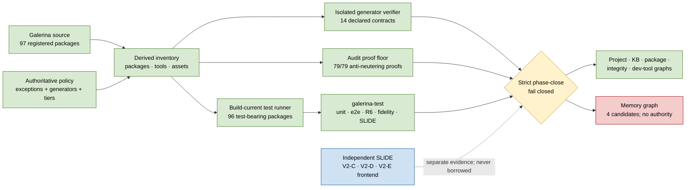

# Zero-Trust Tooling and Test Refactor — Completion Evidence

**Date:** 2026-07-29  
**Branch:** `codex/slide-v2-architecture`  
**Push status:** local commits only; no push performed  
**Verdict:** implementation and all discoverable verification are complete;
the full exit gate remains **non-authorizing** on one genuine owner-only
memory-tree selection.

## Architecture

Green means implemented and freshly verified. Amber means the orchestrator is
working correctly but cannot authorize while a child is red. Red is the
deliberate fail-closed memory-selection refusal. Blue is evidence owned by the
independent SLIDE repository, not Galerina.

## What this refactor cut

- Workspace-only package discovery that omitted real package directories.
- Omission of benchmarks and Myco from the root aggregate.
- Passing against a stale pre-existing `dist/`.
- Empty or unparseable test output being counted as success.
- A phase-close parent that returned zero after a failed child.
- Audit/lint tools with no executable anti-neutering proof.
- Compiler package graphs that reported unexplained SLIDE/Fungi orphans but
  still passed.
- A Galerina SLIDE result being mistaken for independent SLIDE evidence.
- Generator verification that wrote into the repository under test.
- Timestamp-based generated freshness, where checkout or `touch` could create
  a false stale verdict.
- Phase-close graph/catalog commands that silently regenerated the evidence
  while judging it.

## What was rebuilt or added in Galerina

- Bidirectional reconciliation of all 97 package directories and workspace
  entries, with one exact reason-bearing no-test exception.
- A build-current root runner covering all 96 runnable packages, including
  benchmark integrity and Myco.
- Standard `typecheck -> build -> node --test` chains for TypeScript devtools
  and `galerina-test`.
- Strict `phase-close` and `exhaustive` tiers with real child exit, timeout,
  signal, malformed-result, and report-only handling.
- A shared tooling inventory and policy contract covering 147 tools.
- Executable anti-neutering evidence for all 79 audit/lint gates.
- Exact compiler `entryPoints`, `loadedAssets`, and reason-bearing orphan
  ownership; the compiler boundary has zero unexplained orphans.
- A distinct non-vacuous Galerina `slide` lane and a separately named optional
  independent child.
- Fourteen declared generator contracts with isolated output redirection,
  undeclared-write refusal, semantic idempotence, provenance validation, and
  non-mutating drift checks.
- Semantic code-index/code-registry provenance checks that validate the
  complete producer stamp and refuse real content drift without trusting
  mtimes.
- Non-mutating phase-close checks for graphs, code index, and code registry.
- Current generated indexes, registries, graphs, reports, provenance, SBOM,
  status, unit data, and package boundaries.

## Beta-v1 curriculum follow-on checkpoint

The completion matrix below records the earlier tooling-refactor close. The
subsequent Galerina-first beta-v1 pass is still active and does not inherit a
completion claim from that close.

- Curriculum diagnostic drift is **29 rows**, reduced from 87 by source and
  checker repairs; it remains release-blocking work.
- Root `check --strict-governance` is a read-only production-policy check. It
  runs effect, secure-tier, and value-state enforcement without creating build
  or signing output.
- Effect inference now uses the structured operation registry in the
  authoritative pass, observes governed clocks, model aliases, service and
  payment adapters, and helper-function effects, and does not mislabel
  explicit PII/PHI or separately verified vault authority as overdeclared.
- Focused fresh evidence: effect checker **65/65**; combined type/value-state
  checker **174/174**; CEC **243/243**; full compiler **5,727/5,727**. Root
  close evidence must be rerun after the remaining curriculum work.
- Wasm/Rust/Python/SLIDE comparison remains deliberately deferred until SLIDE
  has an executable backend.

## Eleven-requirement completion matrix

| # | Requirement | Status | Fresh evidence |
|---:|---|---|---|
| 1 | Reconcile packages; test or govern every package | **PASS** | 97 registered directories; 96 runnable; one exact empty-registry exception |
| 2 | Dispose every audit/lint and prove anti-neutering | **PASS** | tooling contract: 97 packages / 147 tools / 0 violations; gate proofs 79/79 |
| 3 | Declare, execute, provenance-check, and drift-check every generator | **PASS** | generator contract 14/14; direct checks 14/14; provenance 0 violations |
| 4 | Pass every requested devtools, test, and Myco suite | **PASS** | 16/16 package commands; intelligence trace-deprecation rerun 21/21 |
| 5 | Include benchmarks and Myco in accurate root counts | **PASS** | 96/96 packages; 8,524 tests; benchmarks 3/3; Myco 52/52 |
| 6 | Propagate planted child failures | **PASS** | root, harness, phase-close, graph, generator, and convention fixtures all prove refusal/control directions |
| 7 | Remove unexplained compiler SLIDE/self-hosted orphans | **PASS** | package-graph 25/25; 148 compiler files; zero unexplained orphans |
| 8 | Make Galerina SLIDE non-vacuous and include it in `all` | **PASS** | Galerina SLIDE 477/477 from 25 exact files; `all` five/five |
| 9 | Pass strict/exhaustive, graphs, provenance, and independent SLIDE | **OWNER-BLOCKED** | phase-close 82/83 and exhaustive 83/84; only `graph:all` fails because memory selection is unknown; independent SLIDE 30/30 |
| 10 | Publish current generated artifacts and living counts | **PASS** | 14/14 direct post-publication checks; artifact drift 0; provenance 0; 96/96 and 8,524 living counts |
| 11 | Keep all three ledgers explicit about replacement and residual work | **PASS** | `Galerina/docs/TODO.md`, `SLIDE/TODO.md`, and `triLowLevel-v2/TODO.md` synchronized |

## Fresh final verification

- Requested package-local commands: **16/16**.
- Root build-current aggregate: **96/96 packages, 8,524 tests**.
- Galerina harness: unit **8,524**; e2e build **4/4**; conformance
  **10/10**; fidelity **9/9**; SLIDE **477/477**; `all` **5/5** children.
- Complete tooling scripts: **180/180** after the non-mutating phase-close
  regression was added.
- Generator policy: **14/14** isolated contracts and **14/14** direct checks.
- Audit/lint proof floor: **79/79**, zero violations or advisories.
- Graph integrity: **7,661 nodes, 7,937 edges, 45 dependency edges, zero
  violations**.
- Independent SLIDE: complete command **30/30** and explicit four-file
  V2-C/V2-D/V2-E/frontend command **30/30**.
- Strict phase-close: **82/83**; exhaustive: **83/84**. Both are correctly
  `FAIL`, non-authorizing, with only `graph:all` red.
- Graph family: **5/6**. Project, integrity, KB, package, and dev-tool graphs
  pass. Memory graph refuses.

## Genuine owner-only blocker

Four discovered memory directories contain `MEMORY.md`, and none is
authorized as the selected corpus:

| Candidate ID | Files |
|---|---:|
| `ab9db789` | 144 |
| `958d1a5f` | 84 |
| `5d51bdc9` | 2 |
| `b508ab8a` | 45 |

The owner must identify the intended directory path for `--dir <path>` or
`MEMORY_DIR`. File count, recency, and apparent content are not authority.
Until then the memory graph remains unavailable and the overall gate remains
closed.

### Follow-up authority audit

The completed session bridge contains older, explicit project-identification
evidence:

- `_session-bridge/done/0440-...md` (R&D → main) says the most-populated
  `ab9db789` tree was wrong and identifies `958d1a5f` as “this project's
  memory” at 77 files.
- `_session-bridge/done/0441-...md` (main → R&D) accepts that measurement,
  records `958d1a5f` at 78 files, and says the real tree was regression-checked.
- committed fail-close change `8f017543` records the same asking-session
  distinction.

That is useful identity evidence, but it is not silently promoted over the
newer canonical owner-question ledger, which deliberately requires the owner
to provide the exact path. A read-only 2026-07-29 check matched the current
`958d1a5f` path internally by its SHA-256 dir ID, disclosed no path, and
returned exit 1: `MEMORY-GRAPH.json` is missing or stale. The check wrote
nothing.

Therefore the remaining authorization is now precise: confirm whether
`958d1a5f` is the intended tree and authorize refreshing its external
`MEMORY-GRAPH.json`. An old agent-to-agent handover is not sufficient authority
for that external write.

After that one decision:

1. regenerate the selected external graph sidecar;
2. run the selected memory graph in check mode;
3. rerun `graph-all --check`;
4. rerun strict phase-close and exhaustive;
5. record the owner-selected corpus without exposing a private absolute path;
6. only then mark requirement 9 PASS.

## Open work outside this refactor's completed implementation

- Resume the general checked-source-to-V2-D adapter from
  `../triLowLevel-v2/27-GENERAL-GALERINA-FRONTEND-HANDOFF.md` after the exit
  gate is authorized.
- Keep `.gate` on hold; no fallback or implicit integration was added.
- The historical full-product-suite CI decision remains open; local exhaustive
  evidence is not relabelled as CI.
- Code-catalog coverage remains explicitly partial: 80 real code tokens are
  outside the current numeric-tail catalog, including 51 on signing paths.
  The generator reports this; it does not claim absence means unregistered.
- SBOM generation reports 15 hygiene warnings: one non-package `.myco`
  directory and duplicate JSON keys in fourteen package lockfiles. Those
  lockfile warnings are not consumed by the current SBOM dependency model,
  but should be repaired in a separately regression-gated lockfile task.

## Local commit anchors

- `d6ba88cb` — semantic generated freshness.
- `eaca171f` — keep the hostile provenance fixture out of the real catalog.
- `ceeff3f5` — publish semantic provenance evidence.
- `29b8a47c` — make phase-close graph/catalog checks non-mutating.
- `b58c959e` — publish the non-mutating exit-gate evidence.

No commit in this work was pushed.
