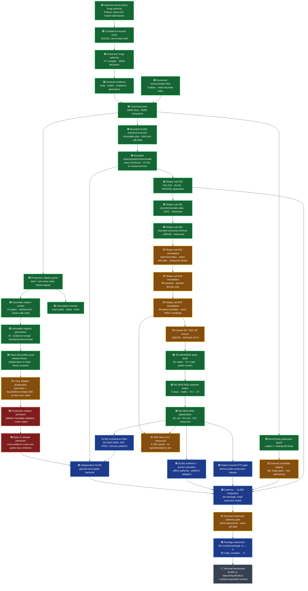

# Galerina beta v1 to SLIDE roadmap

Date: 2026-08-01
Branch: `codex/galerina-beta-v1-completion`
Last verified fixed point: strict **84/84**, exhaustive **85/85**, unified
package lane **98/98** with **8,735** unit tests, graph **5/5**

Policy: zero trust, verify rather than assume, fail closed

This is the live high-level roadmap. It records measured gates rather than an
invented completion percentage. The detailed execution checklist remains
`docs/TODO.md`; the implementation plan remains
`docs/superpowers/plans/2026-07-30-galerina-slide-full-fungi-retirement.md`.

## Status legend

- 🟩 verified at the named checkpoint
- 🟨 active or awaiting a fresh phase-close rerun
- 🟥 release-blocking defect or missing implementation
- 🟦 planned after its prerequisite
- ⬜ deliberately deferred

## Current-state map



The diagram is dependency-ordered, not a claim that all research waits for the
release path. Galerina's repository-local fixed point is green. Beta release
admission remains red because a simulator, process-kill test or one Windows 10
NTFS host cannot prove Windows 11, Linux, macOS, reboot or physical power-loss
semantics. RD-0601 has removed the impossible content-bound N-API/path-loader
task: the first production profile will statically link the admitted adapter
into the signed host. Its repository-local proof is now implemented and
independently re-hashed; signed-host admission and platform evidence remain
open. The closed content-bound SLIDE linker is the later modular replacement.

## Verified progress

| Area | State | Evidence |
|---|---:|---|
| SLIDE architecture reduction R&D | planned | RD-0643 through RD-0650 define the DFE/Shape-Fabric/VPEG split, cut/merge/introduce decisions, security/memory/privacy/platform/package contracts, ordinary and Tri-1 maths, zero-trust scores and independent challenge prompts. The design remains non-authorizing pending owner adjudication and implementation evidence |
| SLIDE reference-platform contract | active | Exact non-authorizing profiles now cover Windows x86-64, Ubuntu/Debian/Fedora/Mint x86-64/Arm64 and macOS x86-64/Arm64. Hostile missing/surplus/accessor/Proxy observations refuse. Current Windows 10 Node-bootstrap suite passes 255/255, but execution evidence remains explicitly `UNVERIFIED`; native and all other platform runs remain open |
| Protected working branch | 🟩 | Local branch exists; commits are local and have not been pushed |
| Flat registry artifact identity | 🟩 | 10/10 exact-byte/path/topology/symlink/resource-limit tests |
| Delegated package-manifest admission | 🟩 | Registry 35/35; app-kernel 149/149; disposable root→operational→manifest chain, future-review and repeated-argument denials |
| Live registry population | 🟩 | False stubs removed; the provenance candidate remains unsigned; the separate hybrid-signed auth manifest is independently verified and is the sole live entry |
| Production registry signing | 🟩 | Exact one-entry index hybrid-signed by operational key `f31…`, independently verified and mutation-tested; SHA-256 `DCF80AA0717DEBF8BEB837584FDC053E24891C0D1224FB4735900E68FC1AAF06` |
| Default production registry consumption | 🟩 | Canonical read-only loader verifies the live root delegation and both operational signature halves before lookup; production revocation comes from one pinned, signed, immutable snapshot; signed index issuance replaces caller-selected wall time; the active epoch and checkpoint-selected generation ID must match. Tower 492/492, app-kernel 165/165, registry 35/35, auth 59/59 |
| Epoch-aware state integrity | 🟩 | Snapshot v2 MAC-binds epoch/key identity; authenticated ring + custody commitment selects active/retired verification keys and refuses unknown/revoked/substituted authority. Sentinel State 20/20; Tower 483/483 |
| Automatic rotation safety/control core | 🟩 | Trigger proposes only; readiness, Triple-Lock, M-of-N, switch, canary, fallback, drain and private-retire phases advance one at a time. Every production phase requires a freshly authenticated checkpoint; a production-admitted complete candidate generation is required; accepted delegation/index/generation identity advances only after canary. Disposable-key evidence passes; Tower 492/492 and app-kernel 165/165 |
| Immutable registry generation | 🟩 | Domain-separated SHA-256 ID, canonical bounded bytes/times, package-relative artifact paths, null install scripts, exclusive same-directory staging/publication, flush/re-open/hash/signature/correspondence verification, distinct verified-vs-host-evidence runtime brands, authenticated checkpoint schema and production loading by exact ID are implemented. Current signed artifacts reproduce generation `f3b432d31f10217006f88c0c39779ba5ae061e0728301b5021979af1cd63dbca`; Tower 492/492 and app-kernel 165/165 |
| Deterministic activation fault model | 🟩 | Seed-ordered fifteen-boundary simulator, canonical replay receipt, control plus planted-fault matrix, budget/unreachable/ambiguous-input refusal and checker-clean `.fungi` terminal fold are implemented. App-kernel 180/180. Simulation is deliberately non-authorizing and cannot replace platform crash evidence |
| Production custody and artifact activation | 🟥 | The least-authority custody contract, disposable executor, generic fail-closed durability seam, fifteen-boundary simulator and closed native-adapter descriptor/host gate exist. The zero-dependency Windows candidate is 7/7: host refusal, a live native directory `FlushFileBuffers`, and exclusive no-replace generation publication with exact stable-handle re-read plus hard-link refusal succeed on this Windows 10 NTFS host. A separate seven-boundary process-termination matrix is 7/7: prior authority stays exact and candidate bytes are absent or exact. The fault worker/observer is absent from default builds. A non-executing artifact inspector also passes 7/7 and binds fixed-path single-link bytes to PE/ELF/Mach-O architecture plus SHA-256. All remain non-authorizing. The production digest list remains empty. Release remains blocked on the statically linked signed-host proof, hostile parent-namespace resistance, and Windows 10/11 + Linux + macOS kernel/reboot/power-loss matrices |
| Native executable identity | 🟨 | Primary documentation confirms standard Node/Windows/Linux/macOS addon loaders are path-based; Windows `LoadLibraryExW` requires `hFile=NULL`. RD-0601 therefore selects a statically linked first profile and a closed content-bound SLIDE linker as its modular successor. The optimized static-profile binary now binds the embedded adapter source, authoritative `.fungi` contract, ABI and release profile; an independent Node verifier re-hashes those sources and the executable, and a hostile external `.node` decoy cannot change its result. The proof is non-authorizing until the host executable is signed and the named platform matrices pass. Pathname loading remains development-only; no owner adjudication is pending |
| Linux adapter preparation | 🟨 | A platform-neutral measured-facts gate, bounded `mountinfo` row/deepest-component selector and exact filesystem-magic/device correlation pass 6/6 on Windows. Only complete stable read-write direct-local ext4/XFS/Btrfs facts can reach `CANDIDATE`; mapped/RAID/network/overlay/removable/virtual/unknown storage and malformed, ambiguous or changing inputs refuse. No Linux syscall or storage fact was executed here. Live `statfs`/sysfs measurement, retained-handle publication and Ubuntu crash/recovery evidence remain open in the repository-owned Ubuntu handover |
| RD-0601 through RD-0608 foundation research | 🟩 | Eight primary-source records, checked maths, ten-dimension zero-trust scores and a seven-column decision table are committed in the Knowledge Base. Detached GIR, linked execution, secure index, durable generations, digest agility and offline driver admission are adopt-with-controls directions. VPEG and Neural Shape Engine began as experiment-only; the executable lab evidence below retains VPEG and keeps NSE quarantined |
| RD-0623 B1/B0 and Tri-1 deep audit | 🟩 | Independent raw-sample arithmetic reproduces both n=99 paired comparisons and the five-trit maths. Source inspection shows B0 pays for one candidate semantic build before the same two common verifier builds; B1 replaces only that candidate build with exact reuse. Fixed lane order remains a possible confound. The comparison proves bounded reuse pressure, not VPEG advantage over BA and not a packed Tri-1 speed result |
| RD-0624 neuromorphic patent proximity | 🟩 | Preliminary claim-element engineering screen finds low current proximity between input-dependent fixed-topology proposal-only N2/deterministic VPEG and the asserted dynamic spiking neuron/synapse array claims. Learned neural-subgraph extraction/implantation, dynamic neural topology, spiking delays/refractory state and actuator loops are stop-and-review triggers. This is not legal clearance; formal FTO remains a public-production gate |
| RD-0625 through RD-0631 baseline matrix | 🟩 | Every final lane now has a separate numbered record with ordinary maths, Tri-1/K3 applicability, zero-trust review, use decision and paper gate. B0 and BA remain controls; owner selected B1 VPEG for continued R&D; B2/N1/N2/N3 stay retained laboratories rather than current fast paths. Packed Tri-1 density is recorded only for N1/N2/N3 and is not presented as speed, energy or cache-residency evidence |
| NSE-Micro E11 profile | 🟨 | The complete 14-lane Node reference is implemented and measured: clean source `4109202`, 42 cold/warm/polluted rows and 3,780 exact checks. Warm B0 is 155,660 ns/op, tree 615,520 and int8 737,950; no proposal arm wins. N3/B0 records 135 stops, 135 completions and D1 skipped 0. Exact known logical bytes are recorded, while code, runtime interference, effective cache, counters, migration and physical residency stay `INDETERMINATE`. Retain as research; no production or L1/L2-resident claim |
| B1/B2/N3 paper-review handovers | 🟩 | Six prompts exist: a repository-aware local-Claude and self-contained online-AI version for each lane. They require independent maths, separate Tri-1/K3 analysis, zero-trust score, primary-source research, null controls, alternatives and an honest paper-tier verdict |
| SEC-06 evidence-verdict correction | 🟨 | Self-hash-only benchmark evidence now returns K3 `0` (`INDETERMINATE`) rather than `+1`; internal generation/rendering uses a complete separate internal-consistency record. Digest-consistent forged commit/platform labels cannot obtain an authority-positive verdict. Full SLIDE is 228/228; the local review is recorded, while the app-backed standard scan still awaits its bounded Start-scan setup action |
| SLIDE evidence and atlas owner authorities | 🟦 | Owner approved a separate authenticated SLIDE research-evidence authority and external production atlas-anchor custody. No private evidence key is generated on this host; no Galerina key reuse is inferred. Engineering must still implement the offline ceremony, embedding-authority-owned anchor contract and Windows/Linux/macOS durability/rollback/crash evidence before either claim activates |
| Implicit corpus failures | 🟩 | Zero implicit failures; intentional negatives have explicit ownership |
| `.fungi` source-quality gate | 🟩 | Zero findings at the last full checkpoint |
| Terminal package-retirement authority gate | 🟨 | Implemented and deliberately red: 16/16 focused adversarial tests; 491 tracked package `.ts` paths, 104 production `.fungi` sources requiring exact source/evidence digest admission, 31 detected production host boundaries requiring ownership, 95 `node_modules` trees and one nested native package. R4 shadow-bake authority cannot silently authorize this terminal profile |
| Fungi staging/compiler repair chapter | 🟩 | Dossier audit 10/10; four staged files strict-clean; `for x in xs` lexical resolver scope proved; compiler 5,755/5,755; direct no-shell test boundary 47/47. Candidates remain quarantined pending executable parity and governed admission |
| Read-only production check | 🟩 | `check FILE --strict-governance` enforces production effect, tier and value-state rules without emitting build/signing artefacts |
| Effect authority | 🟩 | Structured registry covers clocks, model operations, governed services/payments, helper propagation, PII/PHI reads and audit evidence |
| Hardware fallback | 🟩 | Non-CPU targets without explicit fallback fail with `FUNGI-TARGET-001` |
| Sensitive-data lessons | 🟩 | PII, PHI, audit-evidence and protected-response examples now emit their exact fail-closed diagnostics |
| Focused compiler tests | 🟩 | Effect checker 70/70; governance verifier 121/121 at this tranche. Static `Native*` enum members remain pure while actual `Native*` invocations still require `native.call` |
| Curriculum drift | 🟩 | 232/232 admitted examples honor their contract; zero known drift and zero new regression; detector self-test 16/16 |
| Full compiler package | 🟩 | Fresh typecheck/build and 5,752/5,752 tests after the native-member regression fix |
| Compiler specification authority | 🟩 | 7/7 canonical stages authoritative; 49/49 auxiliary `.fungi` files clean but non-authorizing; all seven hashes and 60/60 mutation anchors green |
| Governed decision authority | 🟩 | 29/29 authoritative; zero shadow and zero differential candidates remain; TypeScript stays the running differential shadow for the later retirement gate |
| Governed authority hash integrity | 🟩 | 29/29 ledger entries re-derived, signed, #105-admitted and limited to the closed stdlib import ABI; phase-close blocks drift |
| Governed mutation non-vacuity | 🟩 | Full catalog 60/60 killed, zero survivors, zero dirty targets |
| Hostile Myco index boundary | 🟩 | Closed bounded records, root containment, pre-parse byte ceiling, canonical order and traversal/symlink/duplicate/budget negatives; 69/69 plus typecheck |
| TLS/custom channel composition | 🟩 | Certificate admission is mandatory; custom policy is an additional K3 factor and cannot rescue certificate failure; API server 22/22 |
| Remote installer supply-chain gate | 🟩 | Zero download-to-shell findings; planted defect/control self-test; phase-close wired; audit/lint meta-gate 81/81 |
| SLIDE V2 contract provenance | 🟩 | 15 exact live contract/handoff files moved into repository-owned SLIDE with a closed digest-suite manifest; integrity 5/5 and full SLIDE 35/35 |
| Benchmark publication integrity | 🟩 | The audit self-test is 15/15; comparator-only output without its admitted Galerina subject is HIGH; active/latest duplicates, omissions, surplus entries, non-publication leakage and unregistered source directories refuse. GPU probes use direct argv without a shell. The focused framework subject reaches 10/10 handlers with an explicit admitted K3 identity verdict |
| Bounded independent SLIDE prepared executor | 🟩 | Exact V2-D bytes are fully admitted once into a deeply immutable process-local plan; every call recreates SSA/memory/guard/variant/accounting state. 791/791 byte mutations plus copied, proxied, forged and cross-module plans refuse. Independent SLIDE was 47/47 before measurement |
| Bounded Shape Fabric benchmark | 🟩 | Clean SLIDE `573670b` and Galerina `745ff5be`; Windows 10.0.19045 x64, i9-9900K, Node v24.18.0; 2 warmups, 9 samples, 2,048 ops/sample; every checksum exact. Median clean 8,090.17 ops/s, prepared 170,103.91 ops/s, 21.03x. This is fixed V2-D reference evidence, not the terminal cross-runtime result |
| Shape Lab E00 hostile corpus | 🟩 | SLIDE `80d79cd`: bounded raw-byte S0 intake, exact S1-S8 validation and literal F01-F20 coverage are complete. Hostile graph, policy, target, parameter, proposal, atlas and result mutations fail closed or reach their specifically admitted non-authorizing state. Focused evidence is 47/47; the complete independent SLIDE suite is 102/102. Nine schemas parse offline. This closes only the bounded E00 lab contract, not the general backend |
| Shape Lab E01 durable atlas | 🟩 | SLIDE `5ad5e98`; measured implementation `8c869e0af5121bb21de6cbf95ebb8ffcf763b1dd`. The bounded pre-created single-link log has exact length/digest frames, AES-256-GCM payloads, mandatory Ed25519 + ML-DSA-65 generation/commit signatures, append+flush publication, full contiguous-chain recovery, caller-owned minimum anchors, historical key/byte immutability and current graph/target/policy/proof/epoch replay. Every pre-commit byte prefix serves no successor. Focused 22/22, complete SLIDE 116/116 and ten schemas parse. Across 525 exact-byte checks, medians were B0 193,028 ns/op, process-local B1 92,376 ns/op and durable restart 1,526,072 ns/op. E01 was 7.91x the tiny rebuild cost, so this is verified R&D recovery evidence, not a speedup or production storage claim |
| Shape Lab E02 structural retrieval | 🟩 | SLIDE source `2df87f1feed26bb5b4568eac4dd4a7f827d1024b`. Topology bucketing, semantic colour refinement and a non-recursive exact labelled-graph bijection preserve operation, type, effect, capability, failure, attribute, role and edge semantics. The index is capped and immutable; exhaustion is typed `INDETERMINATE`; B2 recompiles the current graph and never serves prior artifact bytes. Complete SLIDE 136/136 and eleven schemas parse. Across 5,600 exact artifact checks, B2 produced 700 MATCH, 350 MISS and 350 INDETERMINATE outcomes. Median B2 was 1,039,045 ns/op versus B0 164,718 ns/op: 6.308x cost, so E02 is retained as verified negative-performance evidence and a deterministic control, not a speedup or production admission claim |
| Shape Lab E03 typed-boundary checkpoint | 🟨 | Remediated SLIDE source `151b316`; deterministic fixed/dynamic/indeterminate analysis, immutable value-free plans, ephemeral i32/Boolean/K3 bindings and same-implementation current-B0 byte comparison are executable. Fresh evidence is 7 samples × 100 operations and digest `sha256:03ee38692a6de5199d7819310a6757cc0a3367b2b19f143351fba064472bb906`. Exact prototype/prototype admission, canonical order, complete semantic re-derivation and typed-array snapshot intake now fail closed. The earlier negative-performance conclusion is unchanged; no independent-implementation, authenticated-evidence or Galerina-authority claim is made |
| Shape Lab E04 packed and learned controls | 🟨 | Remediated SLIDE source `151b316`; canonical five-trit packing, matched 64×32 int8/Tri-1 controls and bounded prototype/energy/cascade proposal lanes end in same-implementation current-B0 byte verification. Complete SLIDE is 226/226 and all 19 schemas parse. Across 99 samples × 100 operations, medians are B0 148,769 ns/op, int8 inference 6,266, prepacked Tri-1 25,461, cold Tri-1 203,943, N0 rule 354,943, N1 int8 370,236, N1 Tri-1 390,171, prototype 364,081, energy 370,521 and cascade 413,207. Weight density remains useful, but no proposal lane wins; evidence digest `sha256:cff93495d42af8979dd197744d239bc926bea990d70a2900a036f86370d53d96` |
| Shape Lab E05 final matched experiment | 🟨 | Remediated SLIDE source `151b316`; graph-responsive N2, exact recipe grammar, fixed N3 cascade and B0/BA/B1/B2/N1/N2/N3 common verifier are executable. Across 99 paired samples × 50 operations, medians are B0 486,060 ns/op, BA 462,480, exact VPEG B1 459,644, B2 1,893,364, N1 912,636, N2 747,348 and N3 1,859,756. Exact paired analysis finds B1 versus BA indeterminate (Hodges–Lehmann −2,379 ns/op; 95% bootstrap CI −4,612 to 1,338; p=0.159069651881237845), while B1 is a candidate faster than B0 in this run (HL −24,823; CI −26,162 to −23,612; p=0.000000000000022890). RD-0623 confirms the arithmetic but records that B0 performs one extra candidate build and that fixed B0→BA→B1 order may bias timing. This establishes neither VPEG advantage over BA nor production/external-runtime performance. Evidence digests are `sha256:684ac1d8f3d2613af82a4fdf95dd3bf9bcb2863fdd8402a020b9b8f35d6d4f8f` and comparison `sha256:ab3c33c7c732e6aa3984f068967060e0f51a3a391a1e62fe8c903d56d7235010` |
| Shape Lab adversarial-review closure | 🟨 | Claude-08, SEC-05 and SEC-06 were adjudicated into bounded diagnostics/XML, strict typed-array admission, exact prototype/data-descriptor checks, current semantic re-derivation, universal cycle enforcement, honest receipts, hybrid-evidence schema, atlas identity/key mutation coverage, exact paired statistics and the authority-verdict correction. Current source verification is 228/228 tests, 15/15 V2 contract files, 19/19 schemas and 62/62 modules. Files may be internally consistent, but self-hash-only evidence returns K3 `0`; no evidence authority has signed it, so the lane stays amber |
| External flat `.fungi` candidate lane | 🟨 | Four direct-peer candidates pass the per-file strict frontend. The staging audit now requires complete dossiers and has 10/10 controls. GPU/native/Wasm status, vectors and plans exist; their report builders now preserve diagnostics and fail closed on impossible array misses or unknown enum states. All still lack executable parity and governed admission. Substrate Math is reference-only. Nothing has been copied or admitted |
| RD-0634 through RD-0638 AI-research5 adjudication | 🟩 | Current B1 is mechanism-equivalent to BA and remains an exact-atlas/null control; typed-hole VPEG needs a BA-miss/VPEG-hit fixture. Current N3 is additive assurance work and not a fast path. Patent separation remains technical rather than legal clearance; independent translation validation is the next D1 direction. E11 retains all proposed controls and uses corrected E04 timings |
| RD-0639 through RD-0641 learned-compiler/TVM prior art | 🟩 | Primary LLVM/Apache TVM sources confirm learned heuristics, ranking-plus-measurement and fixed-width store features are established. Adopt only as bounded Shape Lab comparators: frozen proposal identity, secret-reduced features, explicit budgets, deterministic D1 re-admission and total-path cost. No external tuner, prediction or hardware timing receives semantic authority |
| RD-0642 measured E11 adjudication | 🟩 | Re-derived representation/working-set maths, hostile-boundary evidence and the ten-dimension score are recorded. Weighted zero-trust architecture score is 8.65/10, but measured benefit is 2/10; decision remains experiment-only and worth a defensive/negative paper after cross-platform statistics |
| Knowledge Base close | 🟩 | Local KB commit `2a5426a` includes RD-0642 and the detailed local independent-review prompt; its tree has no unmerged or interrupted operation and is clean. No push occurred |
| Live status authority | 🟩 | `governance/status-ledger.json` replaces the June free-text `version.json.openTasks` snapshot for live navigation. The schema admits at most eight unique bounded gates and only existing canonical repository `docs/*.md` evidence. Fixed-buffer double reads plus descriptor pre/mid/post checks enforce 16,384 bytes before allocation/decode/parse; missing, malformed, traversal-bearing, literal-duplicate or escaped-duplicate authority is refused without historical fallback. It is informational and cannot authorize release or production activation. Status-focused tests are 7/7, the containing dev-tools fixture is 45/45, and the post-change phase-close passes every blocking child including security 31-file/zero-finding, graph 5/5, generators 14/14 and the complete tooling child |

## Active Galerina work

The 87-row curriculum baseline has been burned down to zero. The final tranche
closed type/governance qualifier drift, root event-gate omissions, protected
egress without explicit authority, unsafe named-model inputs, and raw-secret
model exposure. The `464` package-policy lesson was moved to the ratcheted
`Proposed-*` set because no package-policy grammar or signed root authority
input exists; it is not represented as an implemented lesson.

The compiler-authority chapter is complete. All seven canonical `.fungi`
stages are authoritative specifications while their TypeScript implementations
remain running differential shadows; no `.ts` retirement has started.

The remaining sequence is:

1. Keep the now-green graph/generator/test/strict/exhaustive fixed point
   reproducible while the final registry artifact changes. Current fresh
   evidence is strict 84/84, exhaustive 85/85, graph 5/5 and package 98/98
   with 8,735 unit tests.
2. **Completed:** root-signed serial-1 delegation, operational hybrid auth
   signature, independent manifest verification, live admission, and exact
   one-entry public-only index build.
3. **Completed:** owner hybrid signature, independent public verification,
   exact payload reconciliation and 7/7 returned-artifact mutation refusals.
4. **Completed control core:** epoch-aware state, root-admitted candidate,
   concrete hybrid transition/index proof, trigger-only scheduling,
   readiness/Triple-Lock/canary/drain/fallback/private-retire orchestration,
   authenticated restart after every phase, and exact accepted-artifact
   anti-rollback state. The offline root remains manual.
5. **Completed generic core:** re-sign every admitted package manifest under
   the candidate, build and verify its candidate index, derive the
   domain-separated generation identity, publish/re-open an immutable
   generation behind a required durability barrier, bind authenticated
   accepted state to its exact identity, and load production only by that ID.
   Persistence now requires a module-branded adapter object; the public
   host-evidence factory cannot mint the separate production brand, and a
   copied digest plus structurally similar callback is refused.
   **Completed non-authorizing proof:** the RD-0601 statically linked profile
   binds the exact adapter source, authoritative `.fungi` contract, ABI and
   release build without an external `.node` loader. Its executable is
   independently re-hashed and a hostile loader decoy cannot alter the result.
   **Still required:** signed-host and admitted platform durability adapters
   and Windows 10/11, Debian/Ubuntu, Fedora/Mint and macOS crash/reboot/
   power-loss evidence through least-authority custody before any real
   owner-key rotation is authorized.
   After beta, rebuild the reusable lifecycle mechanism in independent SLIDE
   `.fungi`; Tower Citizen remains the Galerina policy adapter and trust
   domains/keys remain separate.
6. **Bounded non-production work resumed under the owner's full-auto
   direction:** independent SLIDE now has an immutable prepared V2-D executor,
   an exact clean/prepared benchmark, completed E00 F01-F20/S0-S8 evidence and
   a completed bounded E01 durable-atlas experiment. E01's encrypted
   hybrid-signed append log, crash-prefix matrix, minimum-anchor recovery and
   restart re-admission are green only inside Shape Lab. Multi-process writer
   exclusion, portable filesystem adapters, production key/anchor custody,
   rotation/revocation, storage exhaustion and physical-media evidence remain
   unimplemented. Galerina production native activation remains red; no
   loader, rotation or package authority was bypassed.
7. Switch packages in dependency order from TypeScript execution to verified
   `.fungi`/SLIDE execution. The fresh retirement-graph ratchets are 477
   implementation `.ts` files and 491 tracked package `.ts` paths: 26
   twinned, 97 compiler bootstrap, 16 bounded bootstrap-floor and 338 governed
   migration-program paths, plus one nested native package and 95 package-local
   `node_modules` trees. The terminal gates require every debt to reach zero
   without hiding or renaming a member.
   External AIs may prepare flat, quarantined candidates in parallel, one
   direct peer package each. They may not create npm-style nested plugin
   trees, edit Galerina, or claim replacement completion.
8. Run the full governed benchmark and both requested charts only after the
   independent SLIDE backend executes equivalent workloads.

The compact `node scripts/status.mjs` view is now generated from the bounded
`governance/status-ledger.json` navigation authority. Its four live gates are
platform durability, executable SLIDE, parity-proven flat `.fungi` package
retirement, and the cross-platform matrix. The CLI exits non-zero when that
ledger is missing, malformed, larger than 16,384 bytes, contains literal or
escaped duplicate field names, changes across its bounded double read, or
points outside existing repository docs; it never revives the
historical June `version.json.openTasks` prose.

The phase-close display no longer treats an arbitrary child sentence containing
`total` as a test count. Only `tests:core` may consume the aggregate `TOTAL`
row; ordinary Node test children use their terminal `pass`/`fail` summary. A
fixture with `total debt: 999` and `pass 3` now reports `3 tests pass`, and the
runner regression suite is 7/7.

The terminal audit pass has executed every discovered audit/lint tool. Enforced
gates are clean, 60/60 security mutants and 3/3 WAT arithmetic mutants are
killed, the root aggregate is 98/98 packages with 8,735 tests, and the unified
test harness is green across all five lanes. Report-only inventories remain
roadmap evidence rather than being relabelled as green gates: 132 unlowered WAT
nodes, 42 stale negative examples, 0 signing refusal codes without a direct
test mention, and 34 cross-package relative imports. The signing inventory is
now closed at 51/51 directly mentioned refusals with specific negative/control
witnesses.

The fresh unified lane totals are unit 8,735, end-to-end 4/4, conformance
10/10, fidelity 9/9, and Galerina SLIDE-adapter corpus 496/496. The audit
meta-gate covers all 81/81 discovered audit/lint gates with non-vacuous
refusal/control evidence. The tooling contract reports 98 packages and 154
governed tools with zero violations; the generated developer-tool index
separately records 136 developer tools, including 80 audit-class tools.

The governed-memory review now defines eight independent pillars: spatial,
temporal, initialization/type, concurrency, authority, confidential custody,
deterministic resource, and provenance/index safety. The beta memory reader is
read-only and non-authorizing; it refuses injection controls, malformed or
unbounded corpora, graph-health faults, and one identity appearing in both hot
and archive indexes. A plaintext persistent sidecar is not part of the build.
The Wasmtime code formerly under `subprojects/dss-host` is now a single flat,
development-only differential oracle package and cannot acquire runtime,
production, or memory authority.

The terminal verification checkpoint is now green: strict phase-close passes
84/84, exhaustive passes 85/85, graph-all passes 5/5, all fourteen generator
contracts pass, and the exhaustive package lane passes 98/98. A separate
canonical-count run rebuilt the same declared package chains and recorded
8,735 tests with zero failures. The strict cadence first caught stale
code-index line-address evidence; after explicit dependency-ordered
regeneration retained the exact 753-code set, its check mode and the complete
cadence passed. Focused automatic key-rotation evidence is 62/62. These
results authorize their evidence surfaces, not the offline
signing ceremony or beta-v1 release.

The later `8a2bdcf6` fixed point was freshly rechecked after the static-profile
and Linux pure-correlation work. Every blocking phase-close child passed,
including graph-all 5/5, fourteen generator contracts, workspace pointers for
all 98 packages, the complete `.fungi` corpus/example lanes, WAT/Wasm checks,
canonical proofs, a neutral governance diff and the security audit over 31
files with zero findings or errors. This supersedes the earlier fixed-point
commit for current local evidence, but it does not add any live Linux,
crash/reboot/power-loss or production-admission claim.

## Registry admission checkpoint

The registry mechanism no longer trusts a path supplied by a manifest or a
non-empty signature string. A live entry must resolve one direct
`packages-galerina/` child, declare a sorted bounded file set, re-derive its
exact length-framed digest, and verify both hybrid manifest signatures through
an active root-signed operational delegation.

The former auth and healthcare live stubs are gone. Healthcare has no canonical
package and therefore no registry claim. Auth retains a technically reviewed,
owner-approved unsigned 18-file candidate as provenance. The separately
hybrid-signed manifest independently verifies and is now the sole live entry.

This makes package admission and production registry signing green without
making the beta release green. The root-signed delegation, hybrid auth
manifest, public-only build and exact hybrid-signed index independently verify.
Two verified offline custody copies in separate physical locations were
owner-confirmed on 2026-07-30. The first public-only export refused before key
decoding because the wrong file shape was selected. The complete hybrid
environment was then selected and passed the metadata-only structural gate as
canonical UTF-8 with five unique fields and the expected key ID. Independent
public export produced Ed25519 SHA-256
`D27C56FC2E5C7E6BEA5FE7A24BDC318887F1E8FD69FE458DBD4E1FA6B59167D4` and
ML-DSA-65 SHA-256
`1C97131FB9D8DA2A6081CEEC6D5712251573B4DA22EB0509E7915A2035C427D2`;
both match the repository candidates byte-for-byte. The extra online private
working copy has been removed; both custody copies remain offline. The live
repository now admits both public verifier files as non-authorizing material.
The authority CLI validates their exact identities and closed roles, and
signs and independently verifies reviewed package manifests without exposing
private values. Cold root `21415420b447e219` signed the serial-1 delegation
for operational key `f31…`; both hybrid signature halves, serial
floor, active window, exact roles, revocation state and operational public-key
pins independently verify. The operational auth manifest independently
verified at `2026-07-30T16:30:19.180Z` and has SHA-256
`0A1621374BE4CC7E28BF81FEECC19CFC29E2DD5A680417FA7F7E9E145CD60C1C`.
The public-only one-entry index built at `2026-07-30T16:33:10.307Z` has
SHA-256
`15D531566E9FB71F152E34BD9C4C62D4D6FAE15DB0309CBCFA0834BE2E020383`.
The returned signed index is byte-identical at
`packages-galerina/galerina-registry/registry-index-v2.json`. Its SHA-256 is
`DCF80AA0717DEBF8BEB837584FDC053E24891C0D1224FB4735900E68FC1AAF06`;
both signature components verify, its signed payload exactly matches the
public-only rebuild, and 7/7 tampered copies refuse. The live walkthrough now
records completion and authorizes no further signing action.

## Binding package topology

The future Galerina-native package system is not an npm-shaped dependency
forest.

`packages-galerina/` is the single canonical package registry:

```text
packages-galerina/
├── galerina-core/
├── galerina-core-compiler/
├── galerina-core-security/
├── galerina-ext-tritsocket/
└── ...each other package or plugin exactly once
```

The pre-SLIDE ratchet is executable:
`npm.cmd run audit:package-topology`. Fresh evidence records 99 canonical
identities, 95 package-local `node_modules` bootstrap trees, and one exact
deferred nested native package (`galerina-framework-example-app/packages/greeting`).
Any growth fails. The final `--post-slide` profile already refuses all 96 debt
locations and becomes a required green gate after executable SLIDE integration.
The composite `ts-retirement-graph --post-slide` gate additionally requires
zero tracked package TypeScript, terminal execution admission for every
production `.fungi` source, and digest-bound ownership for every detected
production host boundary. Its current 16/16 adversarial suite proves that
renaming debt, unexecuted source, nested identities, dependency trees, unowned
host bridges and substituted evidence all refuse. The resolver, lock,
provenance and migration contract is detailed in
`docs/architecture/flat-package-topology-and-post-slide-migration.md`.

Rules:

- every package or plugin identity is a direct child of `packages-galerina/`;
- a package may contain its own source, tests and assets, but must not contain
  another independently resolvable package;
- dependencies are manifest references to canonical peer identities, not
  copied child dependency trees;
- one admitted identity resolves to one admitted instance and version for a
  build;
- missing, duplicate, cyclic, shadowed, ambiguous or hash-mismatched
  dependencies fail closed;
- package resolution emits a deterministic dependency graph and provenance
  receipt;
- current `node_modules` and TypeScript bootstrap dependencies are not removed
  until executable SLIDE integration supplies their verified replacement.

## SLIDE architecture reduction checkpoint - 2026-08-01

RD-0643 through RD-0650 have re-evaluated the whole proposed SLIDE/Galerina
boundary against the expanded engineering standard. The candidate architecture
formalises the **Deterministic Fabric Engine (`DFE`)** as the closed action-DAG,
topological-scheduling, exact-product, invalidation and crash-publication
coordinator. Shape Fabric is narrowed to deterministic reconstruction,
proof/admission collaboration; VPEG is a typed immutable artifact rather than
another engine; the Fragment Atlas remains a hostile process-local library.

The adoption sequence is deliberately evidence-ordered: detached GIR and its
independent admission, then DFE/B0, exact BA and crash-safe publication, then
flow-region memory and typed security/privacy seams, then native adapters, and
only then typed-hole VPEG. B2, NSE, NSE-Micro and N3 remain preserved research
arms. Current evidence does not admit any of them as a production fast path.

The architecture proposes retiring direct AST-to-WAT production, Node/npm
runtime authority, external index/memory sidecars, automatic driver download
inside compiler/runtime, raw/manual ordinary memory and cached/learned policy
authority. Those paths are not removed until executable replacements and
parity evidence close. Tower Citizen and Tri-Pipe remain Galerina integration
adapters; Tri-Fuse remains a proof-backed compiler pass.

The detailed cut/merge/introduce table, fourteen-criterion review, vertical
architecture diagram, sequencing and zero-trust score are in
`../../ZTF-Knowledge-Bases/RD-0650-slide-architecture-synthesis-cut-merge-introduce-and-adoption-table.md`.
Repository-aware prompt 19 and repository-blind prompt 20 independently
challenge the design with primary-source research, ordinary/Tri-1 maths,
security attacks, alternatives and falsification. The new boundary remains
blue/planned pending owner adjudication; it does not change the verified
Galerina fixed point.

## SLIDE VPEG and dual-engine research

Status: 🟩 E00, bounded E01 durable-atlas and bounded E02 structural
retrieval experiments are complete; 🟨 E03, E04 and E05 are remediated,
measured experiments. Exact VPEG is a candidate faster than rebuild in the
fresh E05 run, but remains statistically indeterminate against the ordinary
action-cache control. None is a production SLIDE backend or admitted Galerina
feature.

The canonical engineering object is a **Verified Parametric Execution Graph
(`VPEG`)**. “Shape shadow” is explanatory language only; it is not a subsystem,
schema, interface, artifact, or diagram label.

The proposed dual-engine system can precompute verified fixed graph structure
at install, first boot, and admitted update:

1. Canonicalize admitted package, plugin, contract, target, driver and policy
   manifests.
2. Build the dependency and lowering graph and topologically order it.
3. Extract Semantic VPEGs and target-specific Target VPEGs, with every changing
   value or state transition represented by an explicitly typed parameter.
4. Hash each VPEG together with all authority-bearing inputs.
5. Let the Neural Shape Engine propose exact, near, composite, or new
   candidates inside a bounded non-authorizing lane.
6. Let the deterministic Shape Fabric re-derive semantics from the admitted
   graph, validate proofs and admit or refuse each candidate. Current Shape
   Lab B0 comparison shares implementation code and is not an independent
   oracle; a separate verifier is required before such a claim.
7. At runtime, reuse only admitted VPEG structure and compute all dynamic
   parameters, guards, loop conditions and effects.
8. On any missing, stale, ambiguous or mismatched input, invalidate the VPEG
   and rebuild it through the full verifier.

A VPEG identity must bind at least:

- source/component and dependency hashes;
- SLIDE/compiler/optimizer version and deterministic profile;
- ABI, layout, memory model and target triple;
- admitted hardware and driver manifests;
- effects, K3 authority, governance policy and security rules;
- optimization recipe and proof/receipt schema.

The VPEG store is a performance mechanism, never authority. The Neural Shape
Engine may discover or synthesize proposals, but neural confidence cannot
create semantics, bypass proof, grant capabilities, collapse K3, or decide
whether stale output is safe. Final admission remains deterministic,
fail-closed and independently verifiable.

The first executable comparison includes these deterministic lanes before a
neural result can count:

1. full deterministic rebuild;
2. an ordinary exact whole-action cache;
3. exact VPEG fragment reuse with complete validation; and
4. deterministic structural retrieval plus full reconstruction.

The ordinary action cache is the null hypothesis. Without it, the experiment
can only prove that reuse beats rebuilding.

The 2026-07-31 Shape Lab now executes full rebuild (`B0`), ordinary action
cache (`BA`), exact VPEG (`B1`), bounded structural retrieval (`B2`) and
NSE-Reflex proposal (`N1`) lanes. E00 adds
bounded raw-byte intake, F01-F20 hostile/control evidence, exact S0-S8 stage
coverage, target/driver derivation, typed parameters, child-DAG closure,
proposal quarantine and complete matched-result validation. Every graph
fixture replays byte-identically through the public decoder and independent
sample counting agrees with the result records. Focused E00 evidence is 47/47.

E01 is complete for its bounded non-production adapter. It uses a pre-created
append-only log because this Windows host cannot flush directory metadata
through Node. Length/digest-framed generations survive every tested tail
truncation without granting partial authority. Atlas payloads are AES-256-GCM
encrypted; generation and commit records require both Ed25519 and ML-DSA-65.
Separate flushes, full-chain recovery, caller-owned minimum anchors,
historical key/byte binding and current-context replay all fail closed. Tests
use ephemeral keys and read no owner material. Focused evidence is 22/22,
complete independent SLIDE is 116/116 and all ten schemas parse offline.

E02 is complete for a bounded process-local structural index. Exact graph
validation precedes topology bucketing, semantic colour refinement and a
non-recursive labelled-bijection checker. Complete semantics and context are
bound; caps close candidate, exact-check, refinement-work and accounted-memory
budgets. B2 returns only `MATCH`, `MISS` or typed `INDETERMINATE`, recompiles
the current graph and compares it with a same-implementation current B0. It
never serves old artifact bytes. Across 5,600 exact checks, median B2 cost was
6.308x B0, so its speed hypothesis failed. The implementation remains as the
mandatory control
for E03/E04 rather than being deleted or promoted.

E03 proves a bounded fixed/dynamic/indeterminate partition, immutable
value-free plan, ephemeral typed bindings and current B0 artifact equality. A
renamed family shares one canonical shape-plan identity after fresh exact B2
mapping and current descriptor/partition verification. Exact B3 cost 6.452x
B0 and renamed-family B3 cost 92.182x; neither had finite break-even. This is
retained negative evidence. E03 stays amber and grants no integration or
package-retirement authority.

E04 proves canonical five-trit storage and exact logical equality with its
int8 control, then keeps rule, prototype, energy and cascade outputs behind a
common current-B0 verifier. The remediated 99-sample run retains the density
result but confirms that every complete proposal lane loses to B0. The
implementation and evidence remain amber for reproduction; they grant no
package, loader or execution authority.

E05 now closes the final matched experiment. N2 responds to admitted graph
features rather than returning one constant recipe, proposals bind canonical
preimages and every lane ends at current-B0 byte comparison. Ninety-nine
paired samples show exact VPEG B1 as a candidate faster than B0 in this run,
but its difference from the ordinary action cache BA is indeterminate. That
null-control result prevents a VPEG speed-advantage claim. N1, N2 and N3 are
slower; their retained code is scientific negative evidence, not authority.
The result and paired-statistics sidecar are self-hashed internal-consistency
evidence only, not authenticated provenance.

RD-0623 puts `B1_EXACT_VPEG_VS_B0_CURRENT` back into active R&D. B0 performs
one candidate semantic build plus the two common verifier builds, while B1
performs exact reuse plus those same two builds. The measured 5.43% candidate
latency reduction is therefore evidence that one reuse avoids work, not that
fragment VPEG beats the ordinary action cache. The next run must use a
pre-registered counterbalanced schedule across fresh processes and bind that
schedule into the newly approved authenticated SLIDE evidence envelope.

RD-0624 separately screens the University of Tennessee NIDA/DANNA patent
family. Current deterministic VPEG and input-dependent fixed-topology,
proposal-only N2 are technically
distant from the inspected dynamic spiking neuron/synapse array claim
clusters. Formal freedom-to-operate review remains mandatory before public
production distribution, and learned neural-subgraph extraction/implantation,
dynamic neural topology, spiking delay/refractory semantics or actuator loops
trigger a fresh stop-and-review gate.

The provenance-bound matched E01 run performed 525 exact-byte checks. Median
costs were B0 rebuild 193,028 ns/op, process-local B1 92,376 ns/op and durable
restart 1,526,072 ns/op. Full durable restart was 7.91x the tiny rebuild and
16.52x process-local reuse. The result retains E01 as a security and larger-
workload experiment but makes no speedup, backend or production-durability
claim. The report and chart are
`../SLIDE/research/shape-lab/E01-DURABLE-ATLAS-COMPLETION-REPORT.md` and
`../SLIDE/research/shape-lab/results/e01-durable-latest.svg`.

The first 2,000-iteration synthetic run remains valid historical evidence:
`BA` and `B1` reduced lab overhead versus `B0`, while `N1` was slower after
proposal and verification. VPEG therefore proceeds; NSE remains
`EXPERIMENT-ONLY` and gains no authority. The 8-byte number is model parameters
only, not total cache residency. Evidence is under
`../SLIDE/research/shape-lab/`; the standalone engineering diagrams are
`../SLIDE/docs/n1-neural-shape-engine-engineering.svg` and
`../SLIDE/docs/b1-vpeg-atlas-engineering.svg`.

The composition is new, but its foundations are established: persistent
incremental object caching in LLVM ThinLTO, declared-input action hashes and
content-addressable output storage in Bazel, unique content-derived store
identities in Nix, and e-graph/fixpoint techniques for retaining and extracting
equivalent optimized forms.

## Sequenced holds

- A bounded SLIDE clean/prepared chart is now published as explicitly
  non-authorizing development evidence for one exact V2-D workload. No new
  Wasm/Rust/Python/Galerina/SLIDE comparison is published until general SLIDE
  execution and the same cross-runtime workloads can be measured. The
  stale-report/catalog gate is green; the full publication audit deliberately
  remains red for two historical subject-absence rows until the complete
  equivalent-work run replaces `latest.json`.
- Literal package TypeScript and `node_modules` retirement is now an explicit
  terminal goal, sequenced after executable SLIDE integration and performed
  one admitted package edge at a time.
- `.gate` remains late in the sequence to avoid rework.
- Independent non-production SLIDE implementation is active. Galerina's
  production activation gate stays red until its separate loader/durability
  evidence closes.

## Owner questions

No owner-only question blocks this chapter. Offline signing is complete and no
signing command is authorized. The loader direction, detached-GIR seam,
VPEG/action-cache controls, Neural Shape Engine sandbox, secure index,
durability, digest agility, and driver-manifest direction are engineering
decisions recorded in RD-0601 through RD-0608. New questions go in
`../SLIDE/QUESTIONS-FOR-OWNER.md` only when evidence cannot resolve a genuine
owner decision.
