# Galerina beta v1 to SLIDE roadmap

Date: 2026-07-29  
Branch: `codex/galerina-beta-v1-completion`  
Policy: zero trust, verify rather than assume, fail closed

This is the live high-level roadmap. It records measured gates rather than an
invented completion percentage. The detailed execution checklist remains
`docs/TODO.md`; the implementation plan remains
`docs/superpowers/plans/2026-07-29-galerina-beta-v1-completion.md`.

## Status legend

- 🟩 verified at the named checkpoint
- 🟨 active or awaiting a fresh phase-close rerun
- 🟥 release-blocking defect or missing implementation
- 🟦 planned after its prerequisite
- ⬜ deliberately deferred

## Current-state map

```mermaid
flowchart LR
    A["🟩 Galerina source policy<br/>.fungi authority<br/>if=Bool, check=K3, match=alternatives"]
    B["🟩 Compiler/curriculum close<br/>232/232, zero known drift"]
    C["🟦 Governed .fungi authority<br/>and beta-v1 features"]
    D["🟦 Full devtools close<br/>graphs, tests, audits, generators"]
    E["🟦 Rebuild and publish<br/>all generated evidence"]
    F["🟦 Beta-v1 release gate<br/>100% required checks green"]
    G["🟦 Offline signing ceremony<br/>owner action after preflight"]
    H["🟦 Independent SLIDE<br/>executable backend"]
    I["🟦 Galerina → SLIDE integration<br/>then retire replaced Wasm/TS paths"]
    J["⬜ Cross-runtime benchmark<br/>SLIDE vs Wasm/Rust/Python"]
    P["🟦 Flat Galerina package resolver<br/>one canonical package instance"]
    M["🟦 Deterministic shape memory<br/>hashed graph fragments + dynamic holes"]

    A --> B --> C --> D --> E --> F --> G --> H --> I --> J
    F --> P
    H --> M
    M --> I

    classDef green fill:#166534,color:#ffffff,stroke:#22c55e,stroke-width:2px;
    classDef amber fill:#854d0e,color:#ffffff,stroke:#facc15,stroke-width:2px;
    classDef blue fill:#1e3a8a,color:#ffffff,stroke:#60a5fa,stroke-width:2px;
    classDef grey fill:#374151,color:#ffffff,stroke:#9ca3af,stroke-width:2px;
    class A,B green;
    class C,D,E,F,G,H,I,P,M blue;
    class J grey;
```



## Verified progress

| Area | State | Evidence |
|---|---:|---|
| Protected working branch | 🟩 | Local branch exists; commits are local and have not been pushed |
| Implicit corpus failures | 🟩 | Zero implicit failures; intentional negatives have explicit ownership |
| `.fungi` source-quality gate | 🟩 | Zero findings at the last full checkpoint |
| Read-only production check | 🟩 | `check FILE --strict-governance` enforces production effect, tier and value-state rules without emitting build/signing artefacts |
| Effect authority | 🟩 | Structured registry covers clocks, model operations, governed services/payments, helper propagation, PII/PHI reads and audit evidence |
| Hardware fallback | 🟩 | Non-CPU targets without explicit fallback fail with `FUNGI-TARGET-001` |
| Sensitive-data lessons | 🟩 | PII, PHI, audit-evidence and protected-response examples now emit their exact fail-closed diagnostics |
| Focused compiler tests | 🟩 | Effect checker 68/68; governance verifier 121/121 at this tranche |
| Curriculum drift | 🟩 | 232/232 admitted examples honor their contract; zero known drift and zero new regression; detector self-test 16/16 |
| Full compiler package | 🟩 | Fresh post-curriculum typecheck/build and 5,748/5,748 tests |
| Compiler specification authority | 🟩 | 7/7 canonical stages authoritative; 49/49 auxiliary `.fungi` files clean but non-authorizing; all seven hashes and 59/59 mutation anchors green |

## Active Galerina work

The 87-row curriculum baseline has been burned down to zero. The final tranche
closed type/governance qualifier drift, root event-gate omissions, protected
egress without explicit authority, unsafe named-model inputs, and raw-secret
model exposure. The `464` package-policy lesson was moved to the ratcheted
`Proposed-*` set because no package-policy grammar or signed root authority
input exists; it is not represented as an implemented lesson.

The compiler-authority chapter is complete. All seven canonical `.fungi`
stages are authoritative specifications while their TypeScript implementations
remain running differential shadows; no `.ts` retirement has started.

The remaining sequence is:

1. Complete governed `.fungi` authority from the top of the dependency chain.
2. Finish the remaining beta-v1 feature work in `docs/TODO.md`.
3. Run all Galerina graph, test, audit, provenance and generator tools.
4. Fix every in-scope finding; do not whitelist or suppress unexplained
   failures.
5. Regenerate the complete build, package indexes, graphs, reports, manifests,
   SBOM and provenance evidence.
6. Run the devtool completion audit and update the final roadmap manually from
   its measured evidence.
7. Run Galerina's internal benchmark suite and publish its chart.
8. Complete the offline signing walkthrough and ask the owner to act only when
   every signing preflight is green.

## Binding package topology

The future Galerina-native package system is not an npm-shaped dependency
forest.

`packages-galerina/` is the single canonical package registry:

```text
packages-galerina/
├── galerina-core/
├── galerina-core-compiler/
├── galerina-core-security/
├── galerina-ext-tritsocket/
└── ...each other package or plugin exactly once
```

The pre-SLIDE ratchet is executable:
`npm.cmd run audit:package-topology`. Fresh evidence records 98 canonical
identities, 95 package-local `node_modules` bootstrap trees, and one exact
deferred nested native package (`galerina-framework-example-app/packages/greeting`).
Any growth fails. The final `--post-slide` profile already refuses all 96 debt
locations and becomes a required green gate after executable SLIDE integration.
The resolver, lock, provenance and migration contract is detailed in
`docs/architecture/flat-package-topology-and-post-slide-migration.md`.

Rules:

- every package or plugin identity is a direct child of `packages-galerina/`;
- a package may contain its own source, tests and assets, but must not contain
  another independently resolvable package;
- dependencies are manifest references to canonical peer identities, not
  copied child dependency trees;
- one admitted identity resolves to one admitted instance and version for a
  build;
- missing, duplicate, cyclic, shadowed, ambiguous or hash-mismatched
  dependencies fail closed;
- package resolution emits a deterministic dependency graph and provenance
  receipt;
- current `node_modules` and TypeScript bootstrap dependencies are not removed
  until executable SLIDE integration supplies their verified replacement.

## SLIDE deterministic shape memory

Status: 🟦 design candidate; not yet an executable SLIDE feature.

The proposed Fabric-style engine can precompute a deterministic memory of fixed
component “shapes” at install, first boot and admitted update:

1. Canonicalize admitted package, plugin, contract, target, driver and policy
   manifests.
2. Build the dependency and lowering graph and topologically order it.
3. Split it into fixed graph fragments and explicitly typed dynamic holes.
4. Hash each fixed fragment together with all authority-bearing inputs.
5. Verify, optimize and store reusable lowering/proof fragments.
6. At runtime, reuse only exact verified fragments and compute the dynamic
   holes.
7. On any missing or mismatched input, invalidate the fragment and rebuild it
   through the full verifier.

A shape key must bind at least:

- source/component and dependency hashes;
- SLIDE/compiler/optimizer version and deterministic profile;
- ABI, layout, memory model and target triple;
- admitted hardware and driver manifests;
- effects, K3 authority, governance policy and security rules;
- optimization recipe and proof/receipt schema.

The memory is a performance mechanism, never authority. A learned model may
rank already-admitted optimization candidates, but it must not create
semantics, bypass proof, grant capabilities or decide whether stale output is
safe. Final selection remains deterministic and independently verifiable.

The composition is new, but its foundations are established: persistent
incremental object caching in LLVM ThinLTO, declared-input action hashes and
content-addressable output storage in Bazel, unique content-derived store
identities in Nix, and e-graph/fixpoint techniques for retaining and extracting
equivalent optimized forms.

## Deliberate holds

- Wasm/Rust/Python versus SLIDE performance claims remain deferred until SLIDE
  has an executable backend and the same workloads can be measured.
- Literal TypeScript and `node_modules` retirement remains after executable
  SLIDE integration.
- `.gate` remains late in the sequence to avoid rework.
- Independent SLIDE implementation starts after Galerina beta v1 is fully
  closed.

## Owner questions

No new owner-only question blocks the current curriculum/compiler chapter.
Existing future questions remain in `../SLIDE/QUESTIONS-FOR-OWNER.md`,
including the exact memory-graph write authority and offline signing roles.
