# Galerina beta v1 to SLIDE roadmap

Date: 2026-07-29  
Branch: `codex/galerina-beta-v1-completion`  
Policy: zero trust, verify rather than assume, fail closed

This is the live high-level roadmap. It records measured gates rather than an
invented completion percentage. The detailed execution checklist remains
`docs/TODO.md`; the implementation plan remains
`docs/superpowers/plans/2026-07-29-galerina-beta-v1-completion.md`.

## Status legend

- 🟩 verified at the named checkpoint
- 🟨 active or awaiting a fresh phase-close rerun
- 🟥 release-blocking defect or missing implementation
- 🟦 planned after its prerequisite
- ⬜ deliberately deferred

## Current-state map

```mermaid
flowchart LR
    A["🟩 Galerina source policy<br/>.fungi authority<br/>if=Bool, check=K3, match=alternatives"]
    B["🟩 Compiler/curriculum close<br/>232/232, zero known drift"]
    C["🟩 Governed .fungi authority<br/>7/7 compiler · 29/29 decisions"]
    D["🟩 Devtools evidence<br/>tests · audits · mutations · generators"]
    E["🟩 Final fixed point<br/>83/83 strict · 84/84 exhaustive"]
    F["🟥 Beta-v1 release gate<br/>owner signing not ready"]
    G["🟨 Registry admission green<br/>auth candidate · live tree empty"]
    H["🟦 Independent SLIDE<br/>executable backend"]
    I["🟦 Galerina → SLIDE integration<br/>then retire replaced Wasm/TS paths"]
    J["⬜ Cross-runtime benchmark<br/>SLIDE vs Wasm/Rust/Python"]
    P["🟩 Flat artifact resolver<br/>exact paths · bytes · limits"]
    M["🟦 VPEG research<br/>verified fixed graph + typed parameters"]
    Z["🟩 Governed-memory/index floor<br/>8 pillars · read-only beta index"]

    A --> B --> C --> D --> E --> F --> G --> H --> I --> J
    Z --> E
    F --> P
    H --> M
    M --> I

    classDef green fill:#166534,color:#ffffff,stroke:#22c55e,stroke-width:2px;
    classDef amber fill:#854d0e,color:#ffffff,stroke:#facc15,stroke-width:2px;
    classDef red fill:#7f1d1d,color:#ffffff,stroke:#f87171,stroke-width:2px;
    classDef blue fill:#1e3a8a,color:#ffffff,stroke:#60a5fa,stroke-width:2px;
    classDef grey fill:#374151,color:#ffffff,stroke:#9ca3af,stroke-width:2px;
    class A,B,C,D,E,Z green;
    class F red;
    class G amber;
    class H,I,M blue;
    class P green;
    class J grey;
```



## Verified progress

| Area | State | Evidence |
|---|---:|---|
| Protected working branch | 🟩 | Local branch exists; commits are local and have not been pushed |
| Flat registry artifact identity | 🟩 | 10/10 exact-byte/path/topology/symlink/resource-limit tests |
| Delegated package-manifest admission | 🟩 | Registry 28/28; app-kernel 149/149; disposable root→operational→manifest chain only |
| Live registry population | 🟨 | False stubs removed; auth is a 63,281-byte unapproved/unsigned candidate; live tree empty |
| Production registry signing | 🟥 | Two-location custody owner-confirmed; owner approval, valid operational public/delegation chain and signing act absent |
| Implicit corpus failures | 🟩 | Zero implicit failures; intentional negatives have explicit ownership |
| `.fungi` source-quality gate | 🟩 | Zero findings at the last full checkpoint |
| Read-only production check | 🟩 | `check FILE --strict-governance` enforces production effect, tier and value-state rules without emitting build/signing artefacts |
| Effect authority | 🟩 | Structured registry covers clocks, model operations, governed services/payments, helper propagation, PII/PHI reads and audit evidence |
| Hardware fallback | 🟩 | Non-CPU targets without explicit fallback fail with `FUNGI-TARGET-001` |
| Sensitive-data lessons | 🟩 | PII, PHI, audit-evidence and protected-response examples now emit their exact fail-closed diagnostics |
| Focused compiler tests | 🟩 | Effect checker 68/68; governance verifier 121/121 at this tranche |
| Curriculum drift | 🟩 | 232/232 admitted examples honor their contract; zero known drift and zero new regression; detector self-test 16/16 |
| Full compiler package | 🟩 | Fresh post-curriculum typecheck/build and 5,748/5,748 tests |
| Compiler specification authority | 🟩 | 7/7 canonical stages authoritative; 49/49 auxiliary `.fungi` files clean but non-authorizing; all seven hashes and 60/60 mutation anchors green |
| Governed decision authority | 🟩 | 29/29 authoritative; zero shadow and zero differential candidates remain; TypeScript stays the running differential shadow for the later retirement gate |
| Governed authority hash integrity | 🟩 | 29/29 ledger entries re-derived, signed, #105-admitted and limited to the closed stdlib import ABI; phase-close blocks drift |
| Governed mutation non-vacuity | 🟩 | Full catalog 60/60 killed, zero survivors, zero dirty targets |

## Active Galerina work

The 87-row curriculum baseline has been burned down to zero. The final tranche
closed type/governance qualifier drift, root event-gate omissions, protected
egress without explicit authority, unsafe named-model inputs, and raw-secret
model exposure. The `464` package-policy lesson was moved to the ratcheted
`Proposed-*` set because no package-policy grammar or signed root authority
input exists; it is not represented as an implemented lesson.

The compiler-authority chapter is complete. All seven canonical `.fungi`
stages are authoritative specifications while their TypeScript implementations
remain running differential shadows; no `.ts` retirement has started.

The remaining sequence is:

1. Keep the now-green graph/generator/test/strict/exhaustive fixed point
   reproducible while the registry population changes.
2. Publicly re-derive and admit the operational bundle; owner-review the
   content-addressed auth candidate; root-sign its delegation; and hybrid-sign
   the complete package manifest. Two-location operational-key custody is
   already owner-confirmed.
3. Move only the independently verified auth manifest into the live tree and
   require the unsigned live-index build to pass.
4. Ask the owner to perform the offline index signing act only after the
   walkthrough reports `READY FOR OWNER SIGNING`.
5. Resume independent SLIDE implementation only after the Galerina beta-v1
   release gate is authorizing.

The terminal audit pass has executed every discovered audit/lint tool. Enforced
gates are clean, 60/60 security mutants and 3/3 WAT arithmetic mutants are
killed, the root aggregate is 98/98 packages with 8,632 tests, and the unified
test harness is green across all five lanes. Report-only inventories remain
roadmap evidence rather than being relabelled as green gates: 132 unlowered WAT
nodes, 42 stale negative examples, 19 signing refusal codes without a direct
test mention, and 34 cross-package relative imports.

The fresh unified lane totals are unit 8,632, end-to-end 4/4, conformance
10/10, fidelity 9/9, and Galerina SLIDE-adapter corpus 496/496. The audit
meta-gate covers all 80/80 discovered audit/lint gates with non-vacuous
refusal/control evidence; the tooling contract reports 98 packages and 151
tools with zero violations.

The governed-memory review now defines eight independent pillars: spatial,
temporal, initialization/type, concurrency, authority, confidential custody,
deterministic resource, and provenance/index safety. The beta memory reader is
read-only and non-authorizing; it refuses injection controls, malformed or
unbounded corpora, graph-health faults, and one identity appearing in both hot
and archive indexes. A plaintext persistent sidecar is not part of the build.
The Wasmtime code formerly under `subprojects/dss-host` is now a single flat,
development-only differential oracle package and cannot acquire runtime,
production, or memory authority.

The terminal verification checkpoint is now green: strict phase-close passes
83/83, exhaustive passes 84/84, graph-all passes 5/5, all fourteen generator
contracts pass, and the exhaustive package lane passes 98/98. The strict
cadence first caught stale code-index and coverage outputs; after explicit
dependency-ordered regeneration, their check modes and the complete cadence
passed. These results authorize their evidence surfaces, not the offline
signing ceremony or beta-v1 release.

## Registry admission checkpoint

The registry mechanism no longer trusts a path supplied by a manifest or a
non-empty signature string. A live entry must resolve one direct
`packages-galerina/` child, declare a sorted bounded file set, re-derive its
exact length-framed digest, and verify both hybrid manifest signatures through
an active root-signed operational delegation.

The former auth and healthcare live stubs are gone. Healthcare has no canonical
package and therefore no registry claim. Auth has a technically reviewed
18-file candidate whose digest re-derives, but all owner governance/signature
fields remain false/null and it stays outside the live tree.

This makes the implementation green without making the release green.
Production still requires an exact valid operational public bundle,
root-signed delegation, owner approval/signature of the auth manifest, a
successful live unsigned build, and the final offline index-signing act.
Two verified offline custody copies in separate physical locations were
owner-confirmed on 2026-07-30.

## Binding package topology

The future Galerina-native package system is not an npm-shaped dependency
forest.

`packages-galerina/` is the single canonical package registry:

```text
packages-galerina/
├── galerina-core/
├── galerina-core-compiler/
├── galerina-core-security/
├── galerina-ext-tritsocket/
└── ...each other package or plugin exactly once
```

The pre-SLIDE ratchet is executable:
`npm.cmd run audit:package-topology`. Fresh evidence records 98 canonical
identities, 95 package-local `node_modules` bootstrap trees, and one exact
deferred nested native package (`galerina-framework-example-app/packages/greeting`).
Any growth fails. The final `--post-slide` profile already refuses all 96 debt
locations and becomes a required green gate after executable SLIDE integration.
The resolver, lock, provenance and migration contract is detailed in
`docs/architecture/flat-package-topology-and-post-slide-migration.md`.

Rules:

- every package or plugin identity is a direct child of `packages-galerina/`;
- a package may contain its own source, tests and assets, but must not contain
  another independently resolvable package;
- dependencies are manifest references to canonical peer identities, not
  copied child dependency trees;
- one admitted identity resolves to one admitted instance and version for a
  build;
- missing, duplicate, cyclic, shadowed, ambiguous or hash-mismatched
  dependencies fail closed;
- package resolution emits a deterministic dependency graph and provenance
  receipt;
- current `node_modules` and TypeScript bootstrap dependencies are not removed
  until executable SLIDE integration supplies their verified replacement.

## SLIDE VPEG and dual-engine research

Status: 🟦 design candidate; not yet an executable SLIDE feature.

The canonical engineering object is a **Verified Parametric Execution Graph
(`VPEG`)**. “Shape shadow” is explanatory language only; it is not a subsystem,
schema, interface, artifact, or diagram label.

The proposed dual-engine system can precompute verified fixed graph structure
at install, first boot, and admitted update:

1. Canonicalize admitted package, plugin, contract, target, driver and policy
   manifests.
2. Build the dependency and lowering graph and topologically order it.
3. Extract Semantic VPEGs and target-specific Target VPEGs, with every changing
   value or state transition represented by an explicitly typed parameter.
4. Hash each VPEG together with all authority-bearing inputs.
5. Let the Neural Shape Engine propose exact, near, composite, or new
   candidates inside a bounded non-authorizing lane.
6. Let the deterministic Shape Fabric independently re-derive semantics,
   validate proofs and admit or refuse each candidate.
7. At runtime, reuse only admitted VPEG structure and compute all dynamic
   parameters, guards, loop conditions and effects.
8. On any missing, stale, ambiguous or mismatched input, invalidate the VPEG
   and rebuild it through the full verifier.

A VPEG identity must bind at least:

- source/component and dependency hashes;
- SLIDE/compiler/optimizer version and deterministic profile;
- ABI, layout, memory model and target triple;
- admitted hardware and driver manifests;
- effects, K3 authority, governance policy and security rules;
- optimization recipe and proof/receipt schema.

The VPEG store is a performance mechanism, never authority. The Neural Shape
Engine may discover or synthesize proposals, but neural confidence cannot
create semantics, bypass proof, grant capabilities, collapse K3, or decide
whether stale output is safe. Final admission remains deterministic,
fail-closed and independently verifiable.

The composition is new, but its foundations are established: persistent
incremental object caching in LLVM ThinLTO, declared-input action hashes and
content-addressable output storage in Bazel, unique content-derived store
identities in Nix, and e-graph/fixpoint techniques for retaining and extracting
equivalent optimized forms.

## Deliberate holds

- The internal benchmark harness and chart generator are integrity-tested, but
  no new Wasm/Rust/Python/Galerina/SLIDE comparison or chart is published until
  SLIDE has an executable backend and the same workloads can be measured.
- Literal TypeScript and `node_modules` retirement remains after executable
  SLIDE integration.
- `.gate` remains late in the sequence to avoid rework.
- Independent SLIDE implementation starts after Galerina beta v1 is fully
  closed.

## Owner questions

No new owner-only question blocks the current curriculum/compiler chapter.
Existing future questions remain in `../SLIDE/QUESTIONS-FOR-OWNER.md`,
including offline signing roles. No memory-graph write authority is requested:
the plaintext sidecar design has been rejected.
